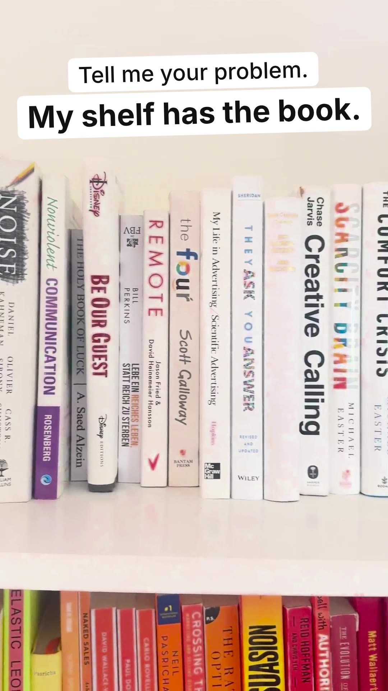

# So 11.10. · Tell me your problem. My shelf has the book.

Reel, 9:16, 25 Sekunden, ohne Ton. Test: echtes Regal statt Grafik. Musik und Sound-Effekt in Edits by Instagram setzen. Als Titelbild `reel_cover.jpg` wählen.

Sound-Effekt an den Stopps (Bild steht, Kreis erscheint):
- 2,9 s: The Comfort Crisis
- 10,8 s: Creativity, Inc.
- 18,4 s: Shoe Dog
- 22,8 s: Schlussfrage

## Caption

```
Tell me your problem.
My shelf has the book.

Three stops today.
A life that feels too easy.
A team out of ideas.
An idea everyone calls crazy.

What is yours?
Comment it, I'll look on my shelf.

#books #bookstagram #bookrecommendations #reading #thefke #booklover #whysocurious
```

## Reel

[reel.mp4](reel.mp4)

## Titelbild


