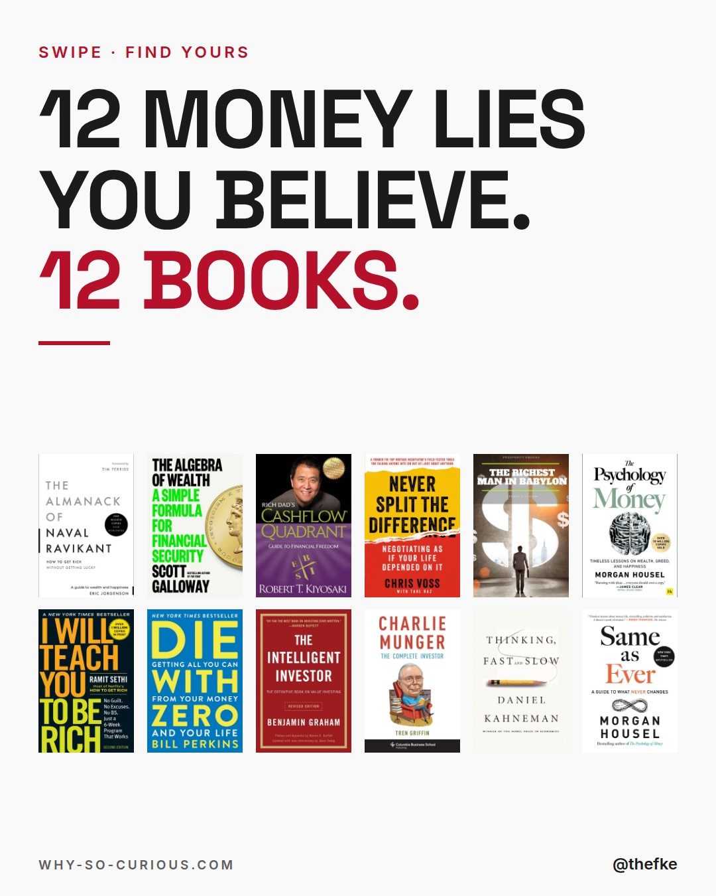
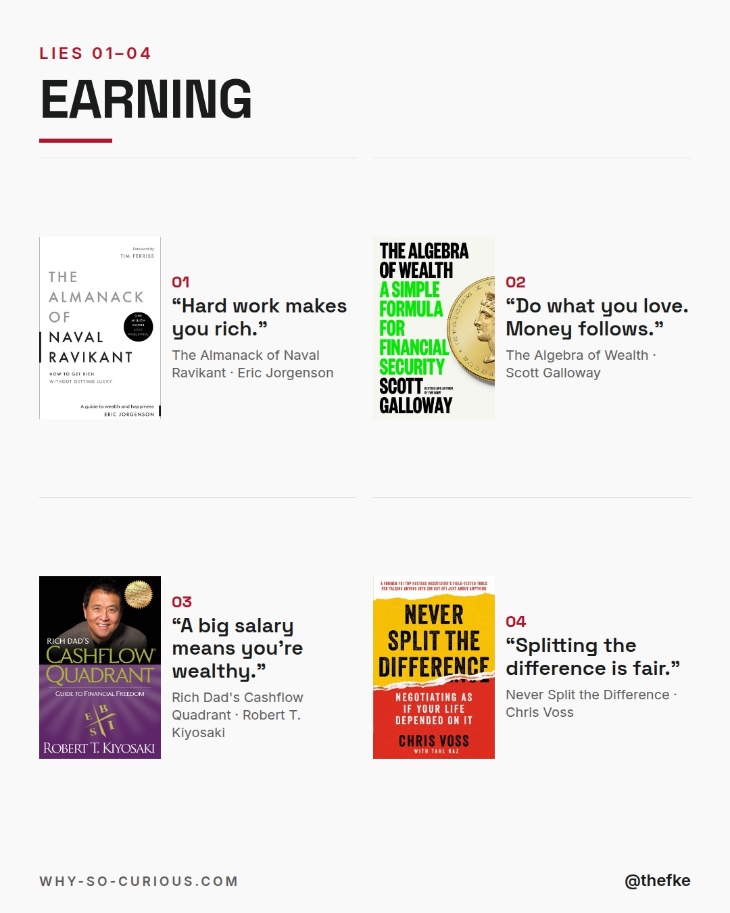
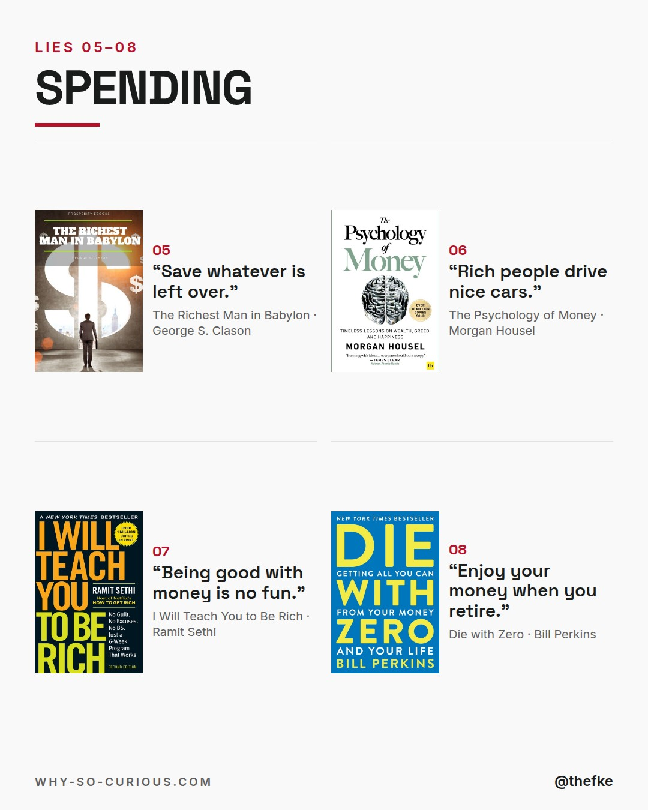
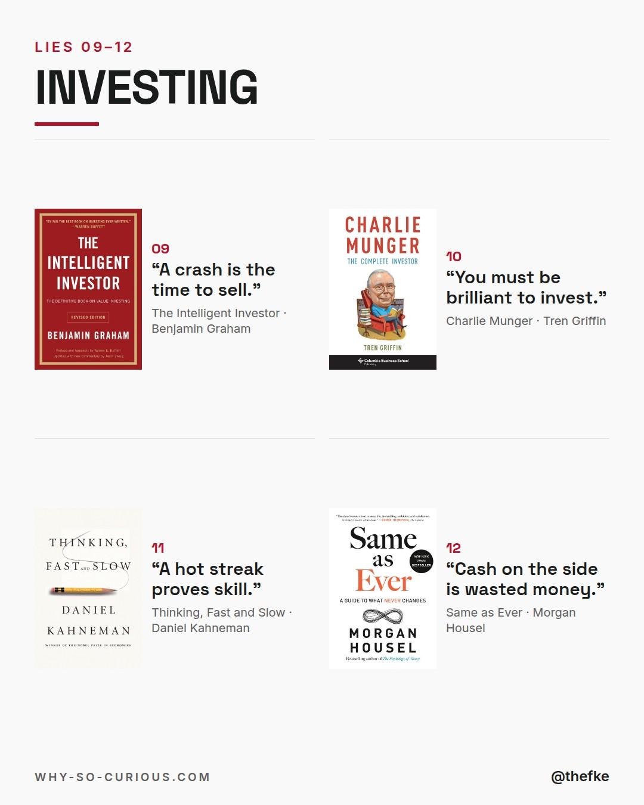
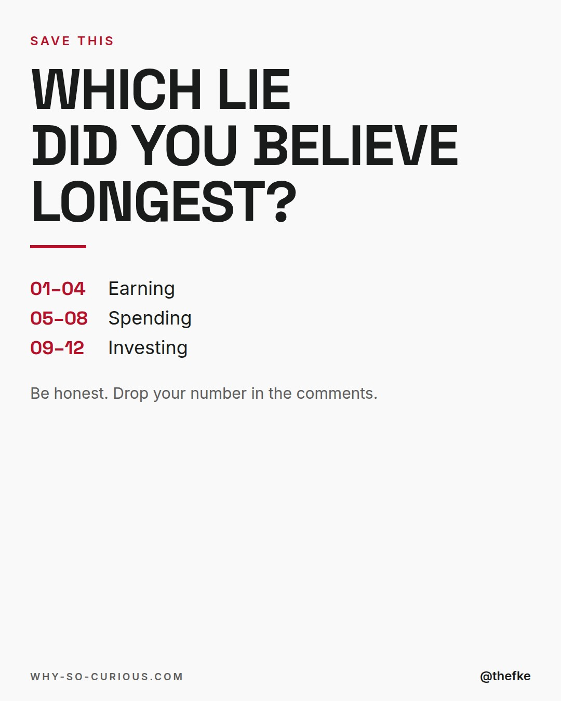

# Fr 23.10. · 12 Money Lies You Believe

Karussell, 5 Slides. Beim Hochladen 4:5 wählen.

## Caption

```
12 lies about money.
Most of us grew up with a few of them.

“Save whatever is left over.”
“Rich people drive nice cars.”
“A crash is the time to sell.”

12 books from my shelf take them apart.
Earning, spending, investing. 4 each.

Number 06 in one line, from Morgan Housel:
“Wealth is what you don’t see.”

Which lie did you believe longest?

#books #bookstagram #bookrecommendations #reading #thefke #booklover #whysocurious
```

## Slides






