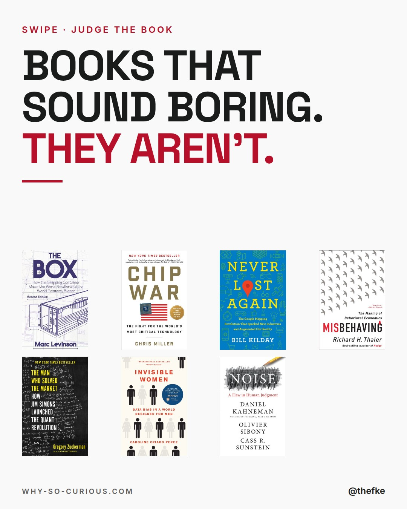
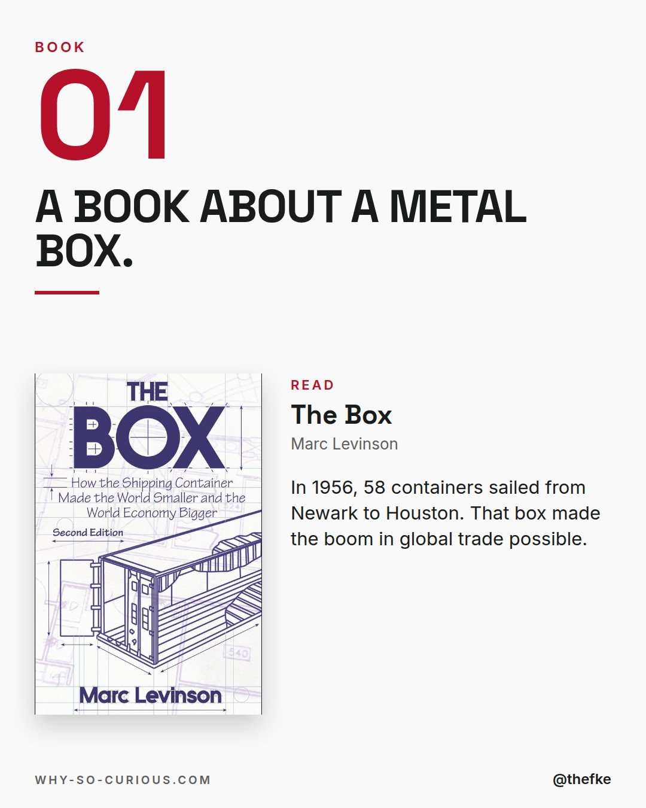
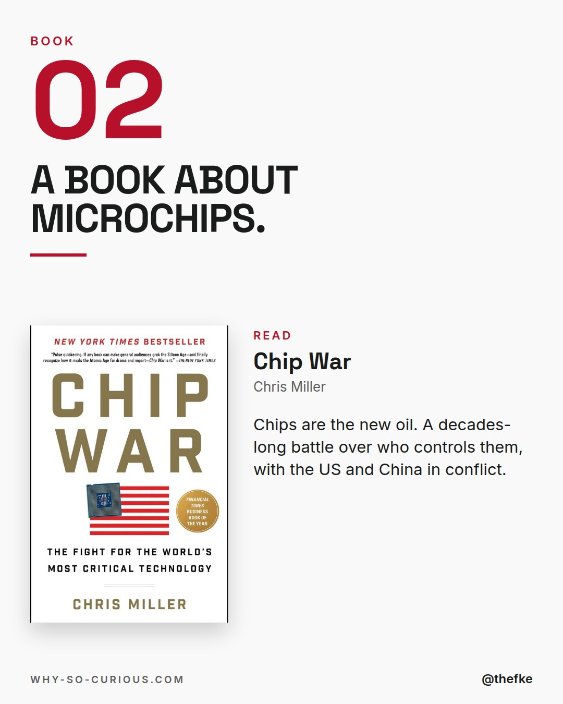
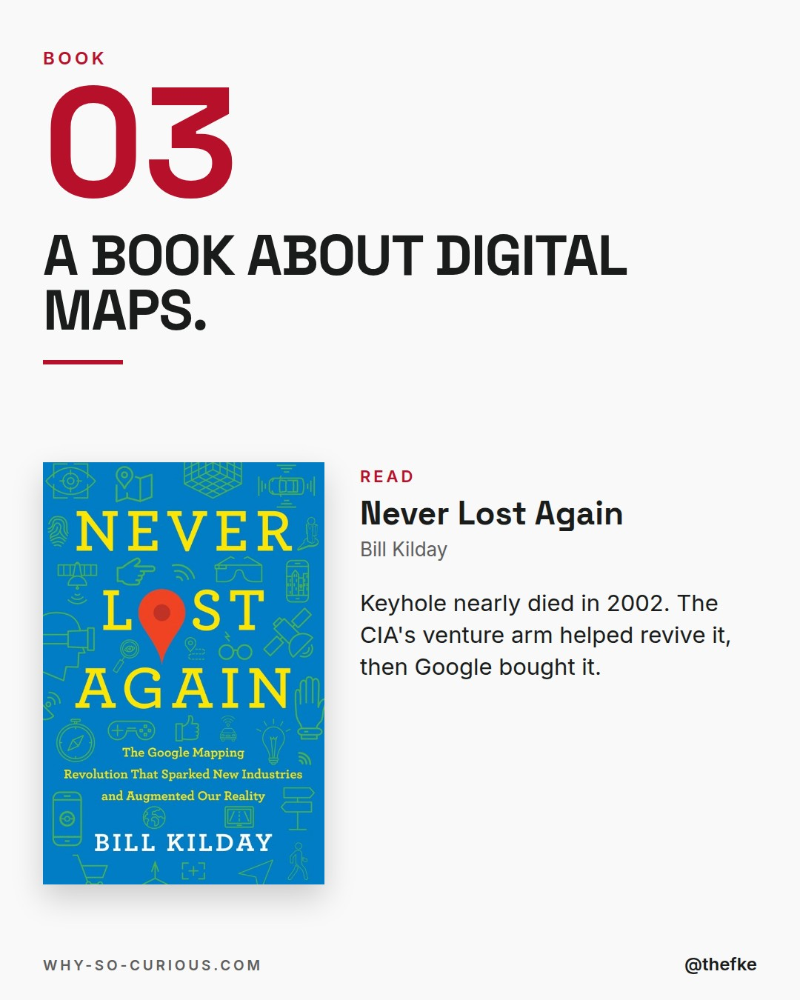
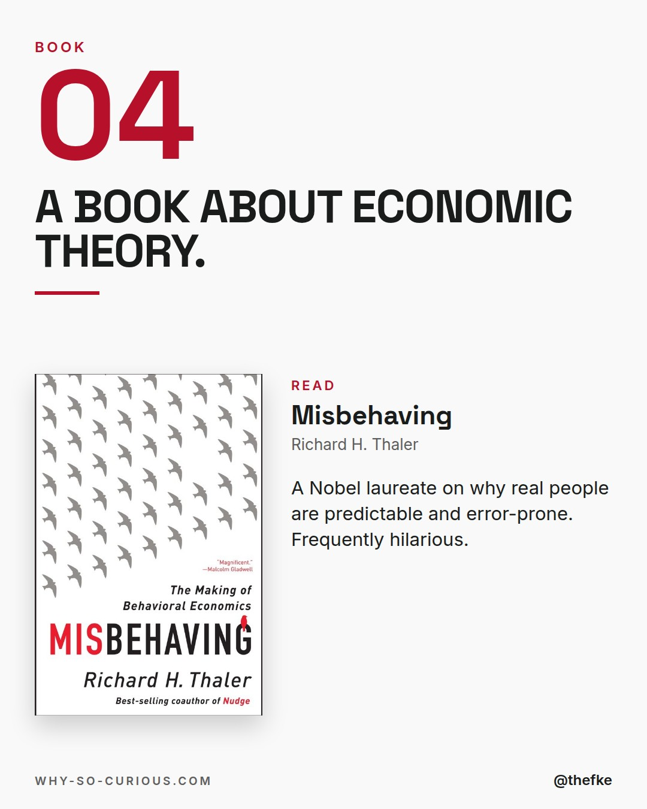
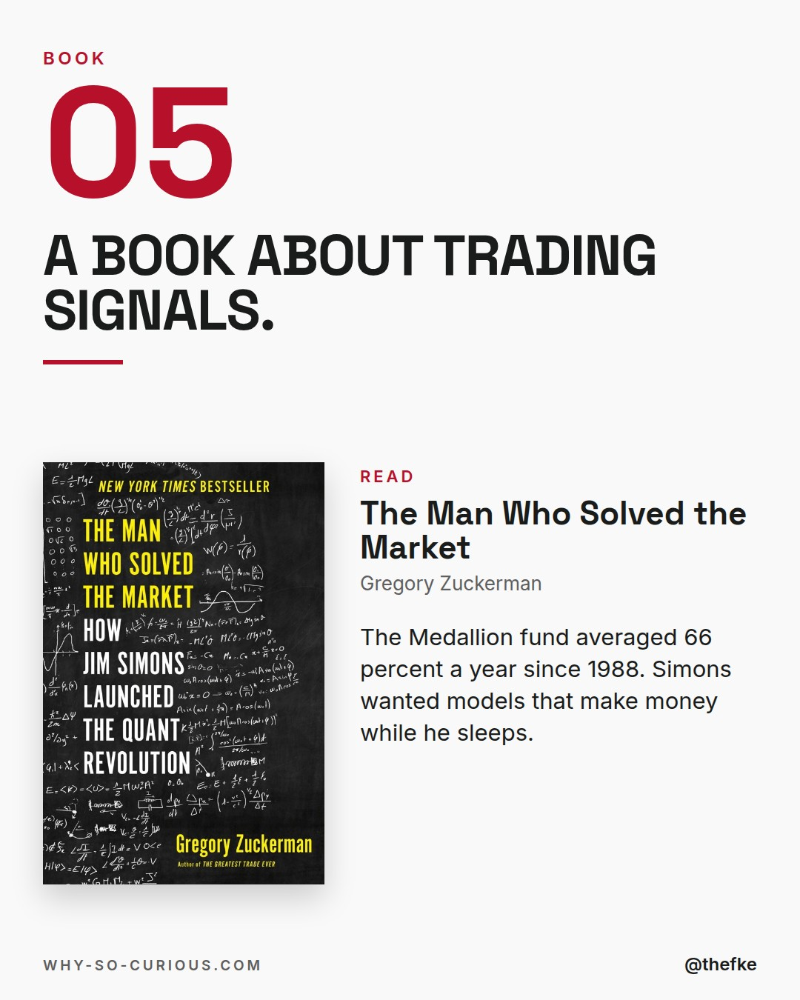
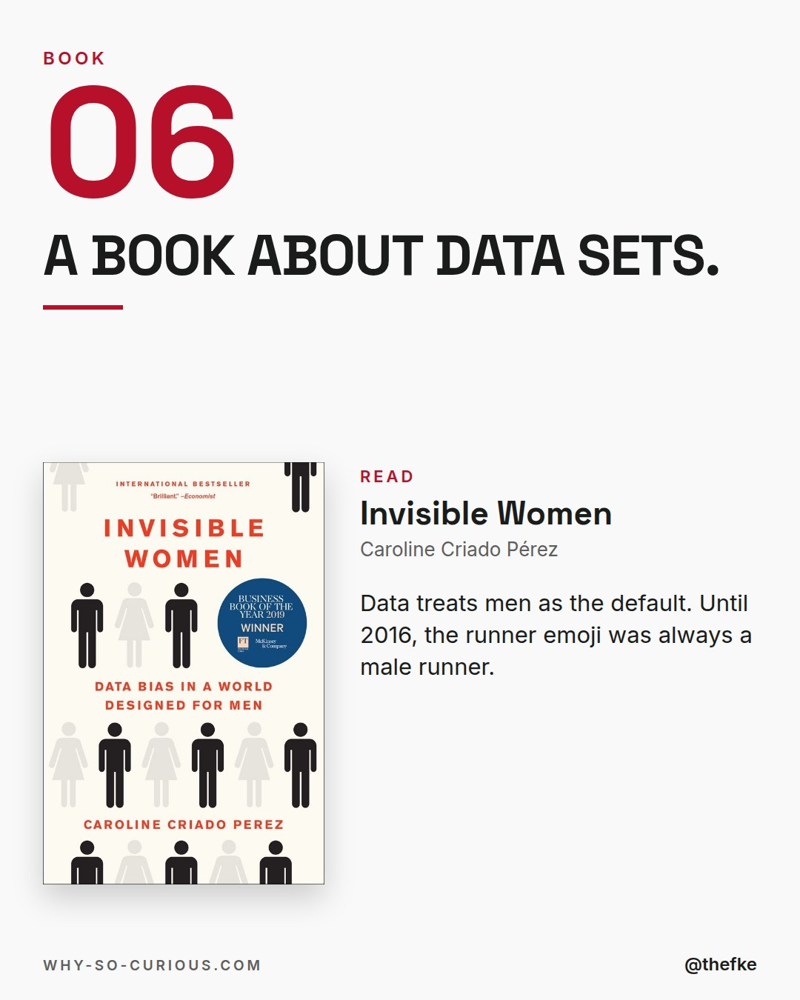
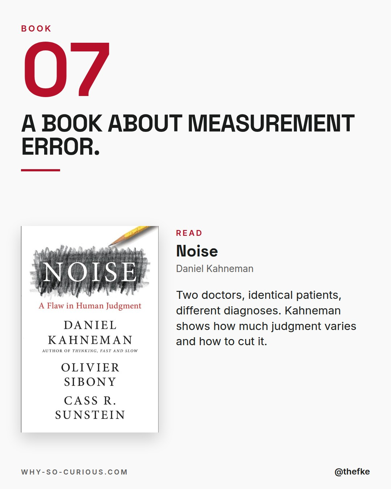
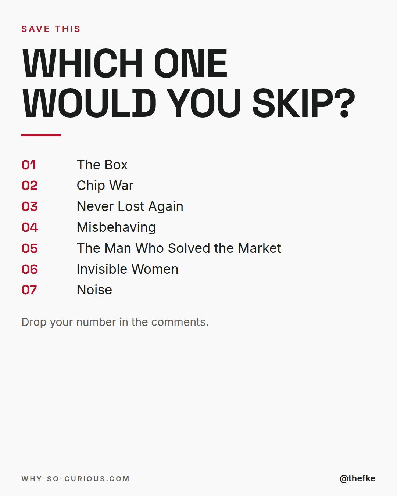

# Mo 26.10. · Books that sound boring. They aren't

Karussell, 9 Slides. Beim Hochladen 4:5 wählen.

## Caption

```
Shipping containers. Microchips. Map software.
Seven titles that look like homework.

Open them and you get spies, billionaires and a Nobel laureate who is funny.
The dry subject is just the cover.

The wildest detail is in Never Lost Again.
The startup behind Google Earth ran out of cash in 2002.
The CIA's venture arm helped bring it back.

All from my shelf.

Which one would you have skipped?

#books #bookstagram #bookrecommendations #reading #thefke #booklover #whysocurious
```

## Slides










