# Di 03.11. · 10 Bad Days, 10 Books

Karussell, 12 Slides. Beim Hochladen 4:5 wählen.

## Caption

```
10 bad days.
10 books.

Fired. Dumped. Burned out. Broke.
Rejected. Grieving.

Each one has a book for exactly that day.
All from my shelf.

One line from Brad Stulberg fits all 10:
“Our perception of time slows during difficulties; just knowing this helps us to be patient and persist; what feels awful today almost certainly won’t feel as bad in far-off tomorrows.”

Save it for the day you need it.
Send it to someone who is having one.

Which day are you having?

#books #bookstagram #bookrecommendations #reading #thefke #booklover #whysocurious
```

## Slides

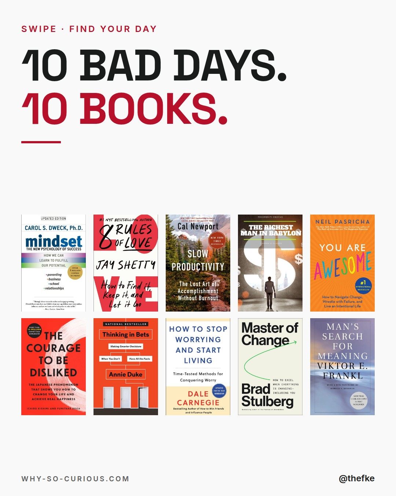
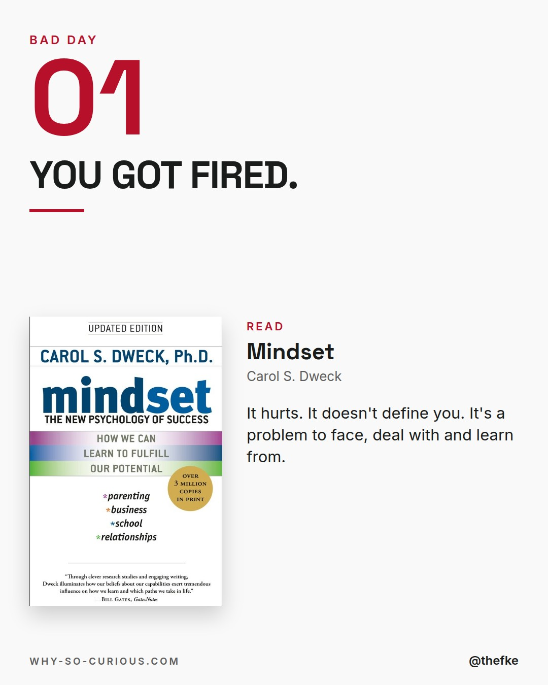
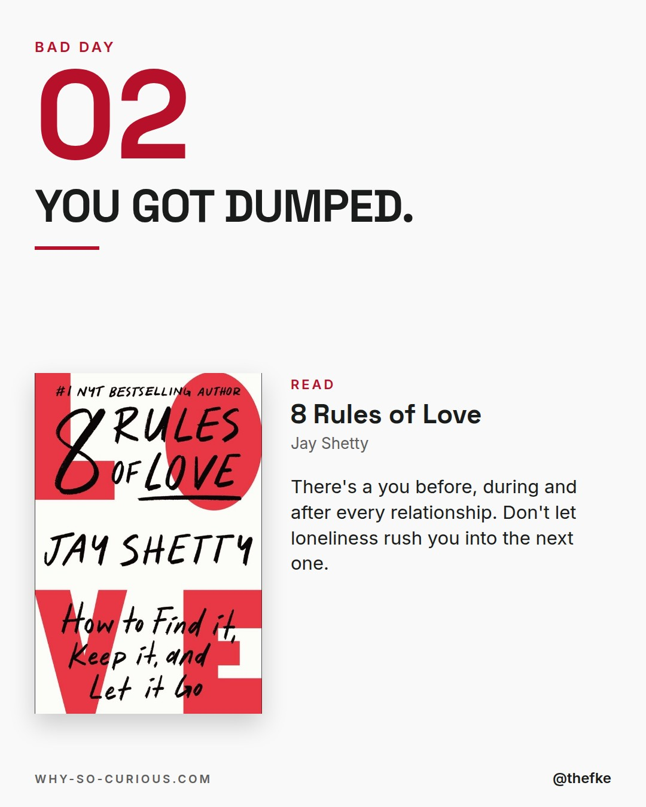
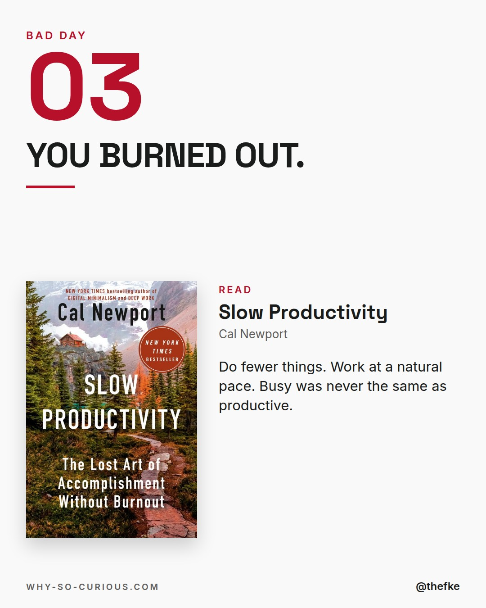

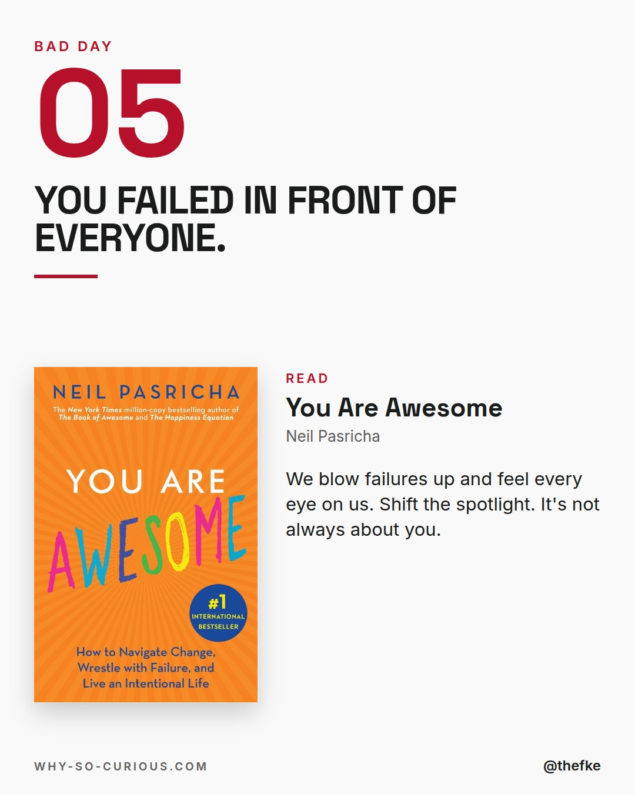
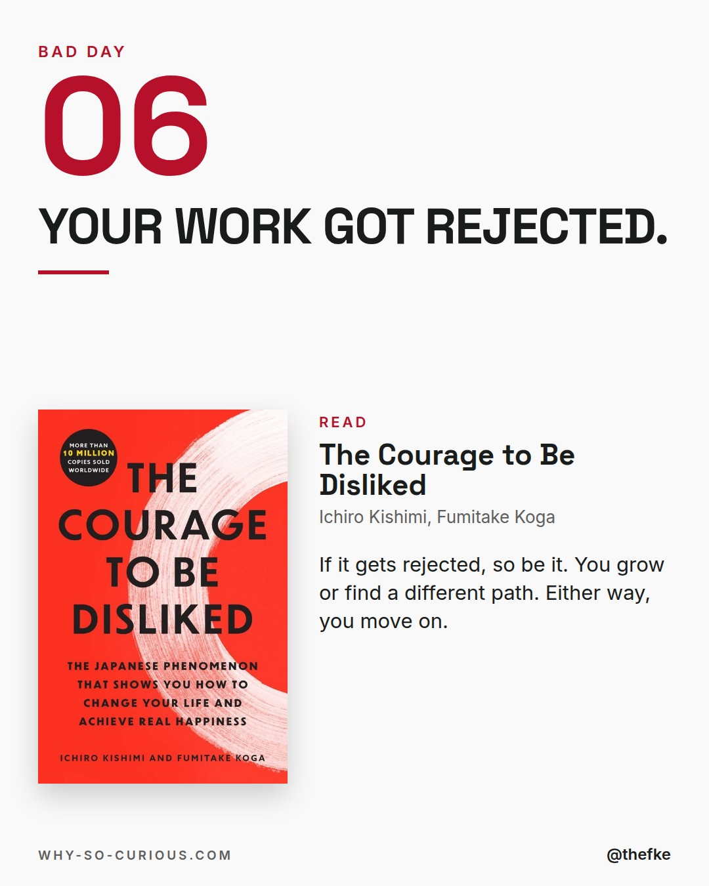
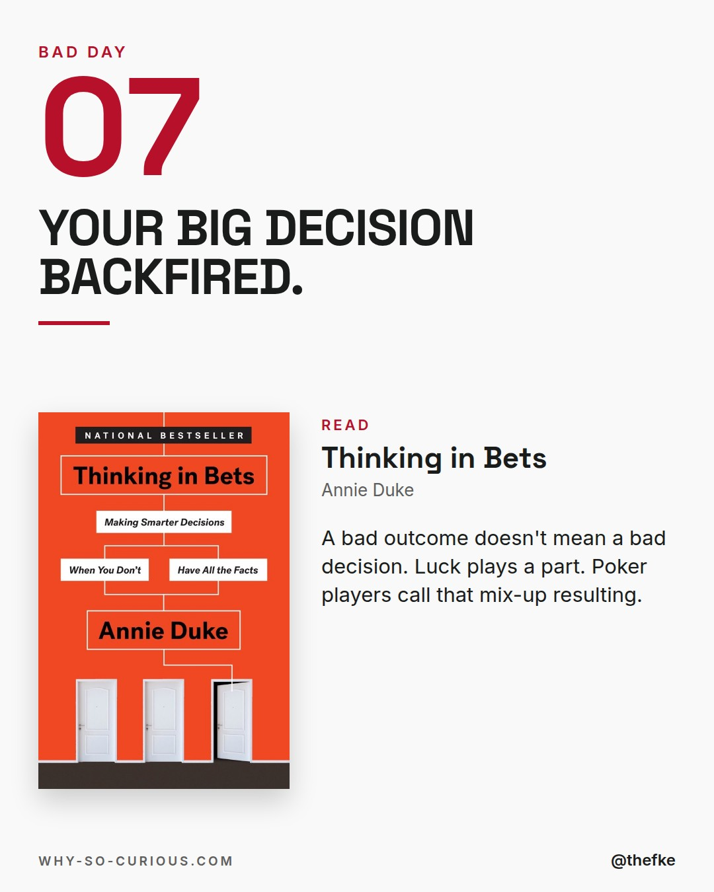
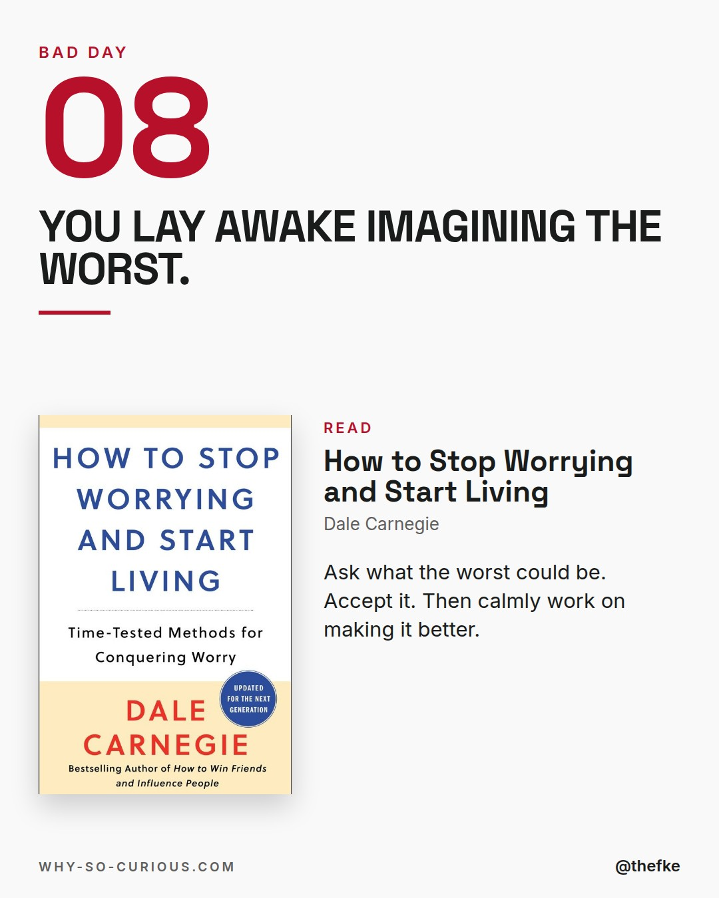
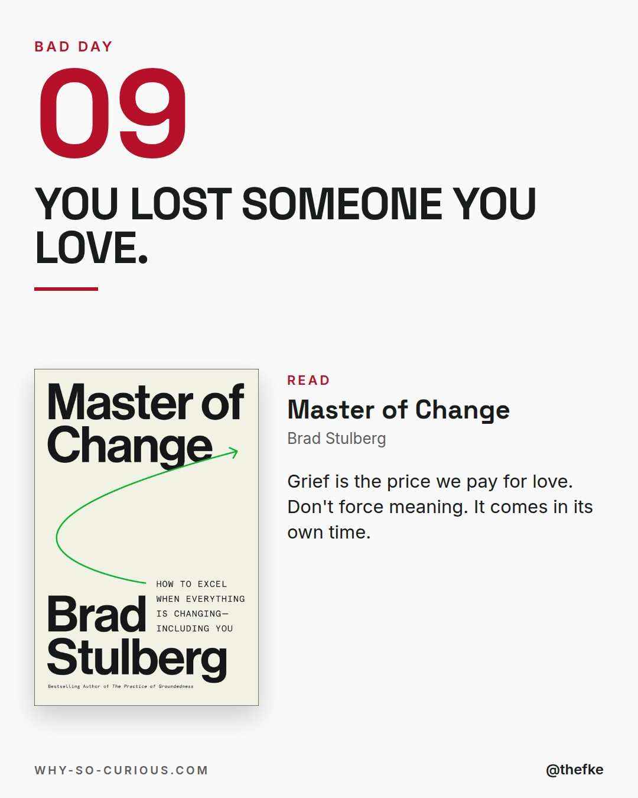
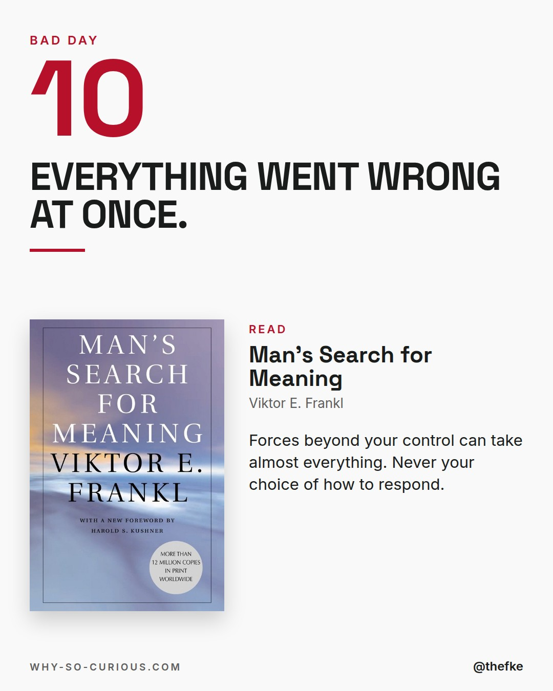
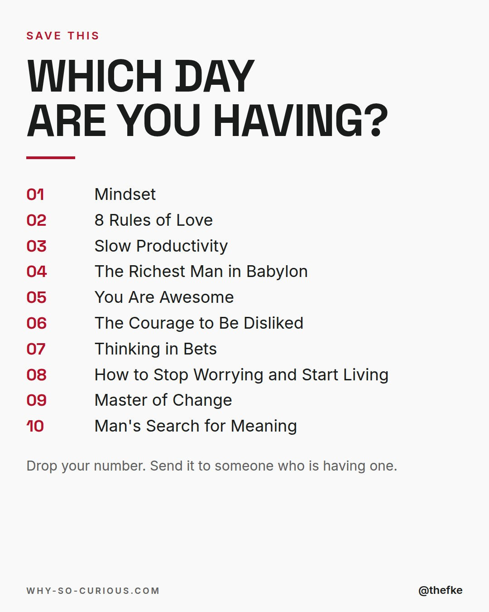
