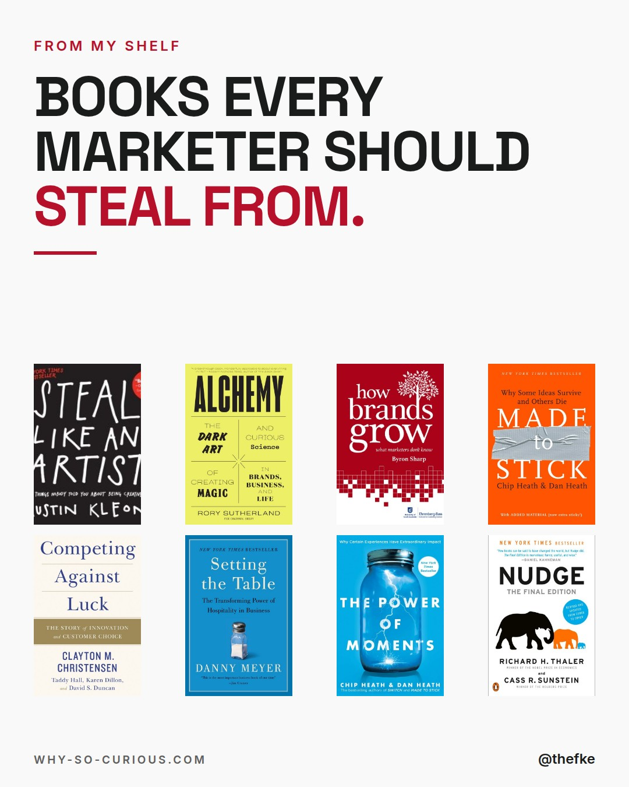
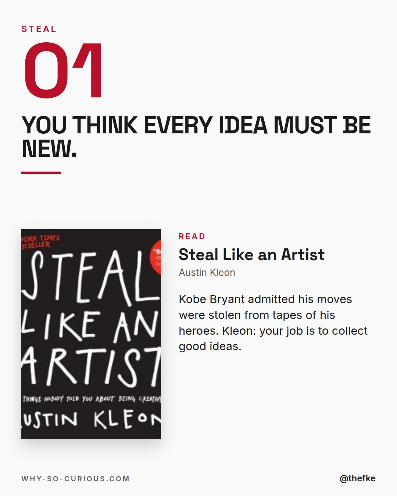
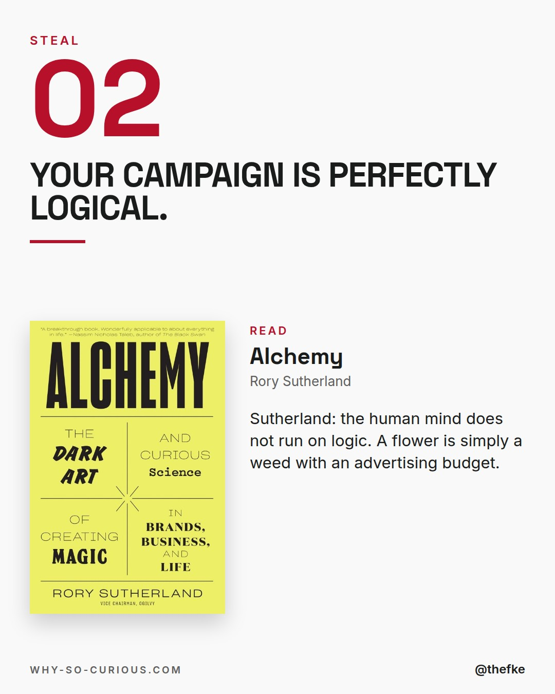
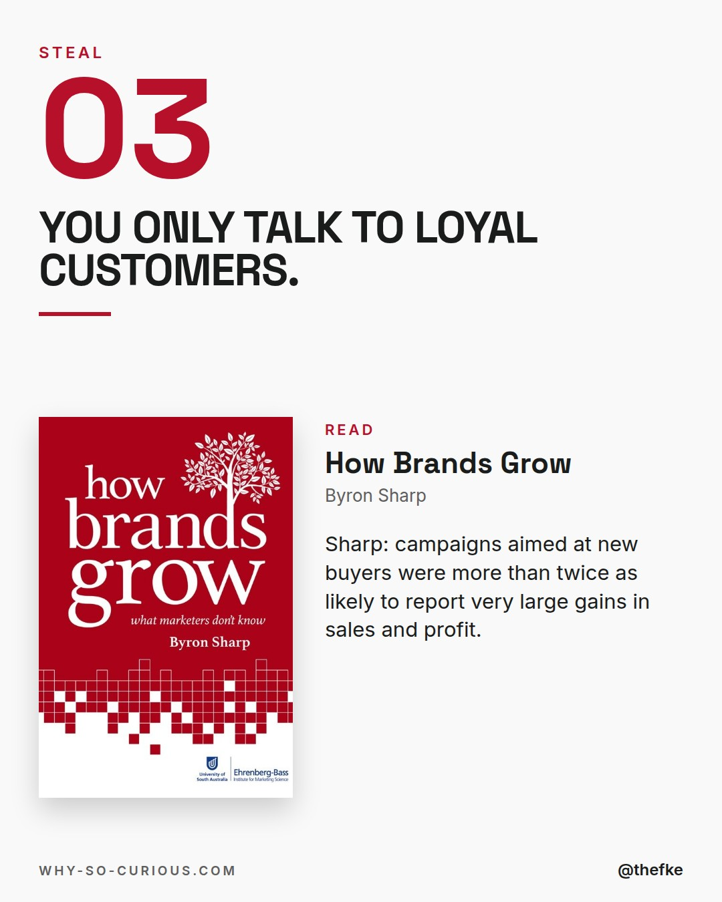
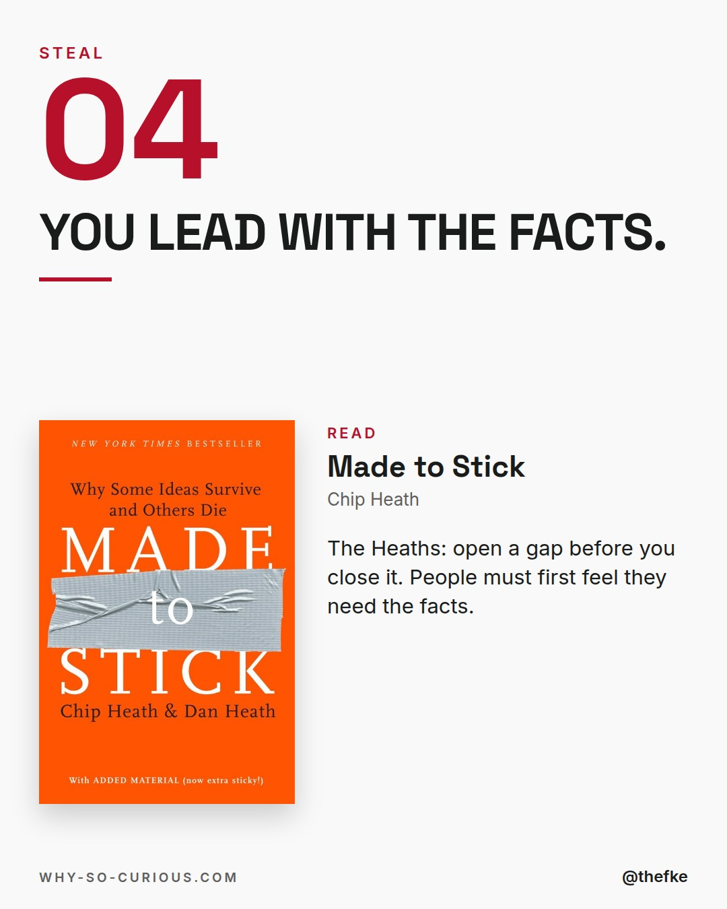
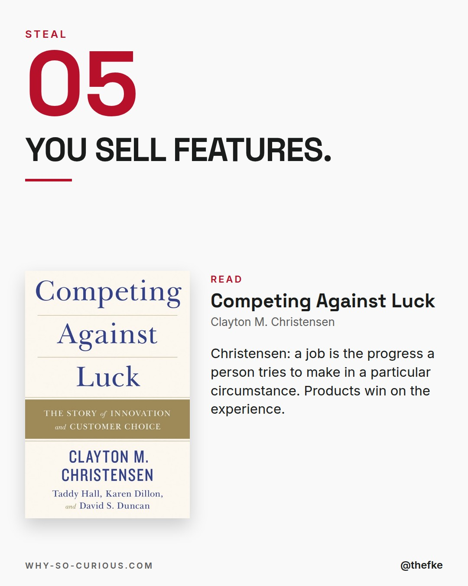
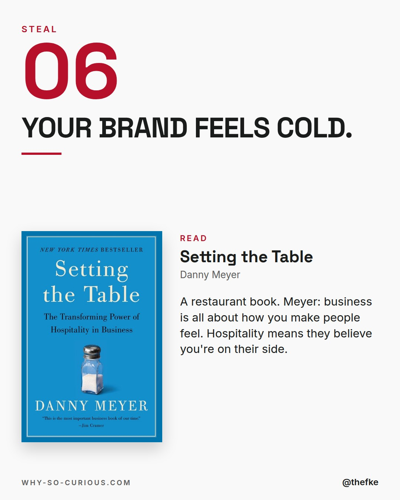
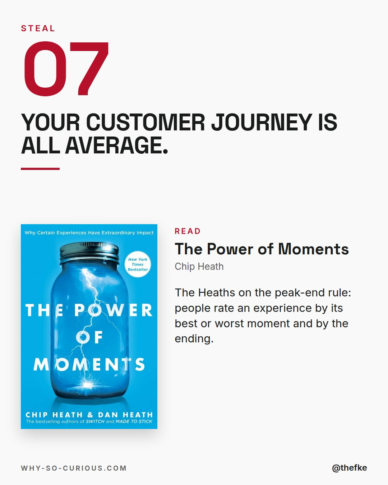
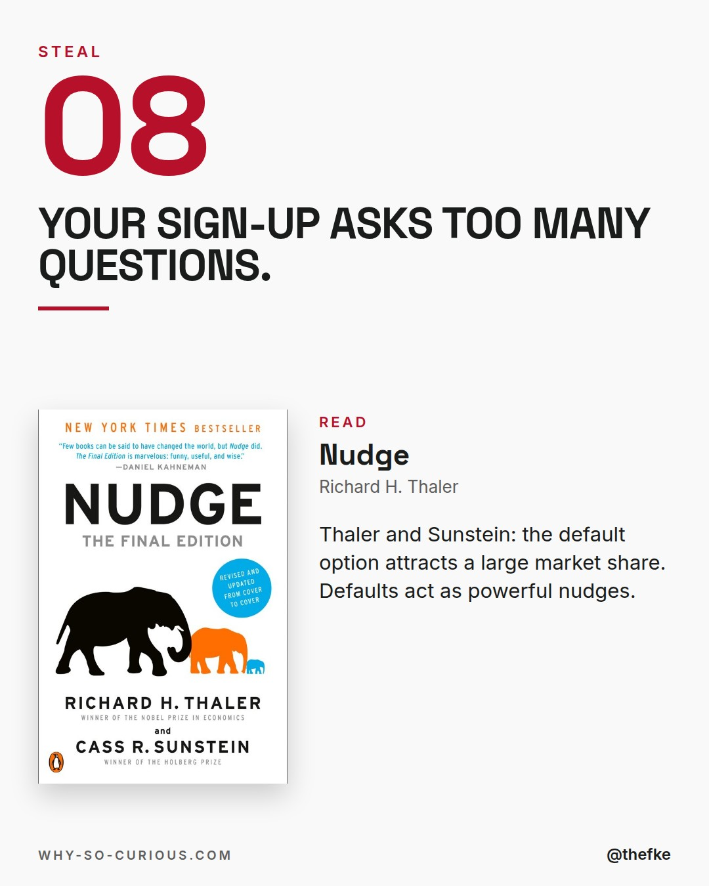
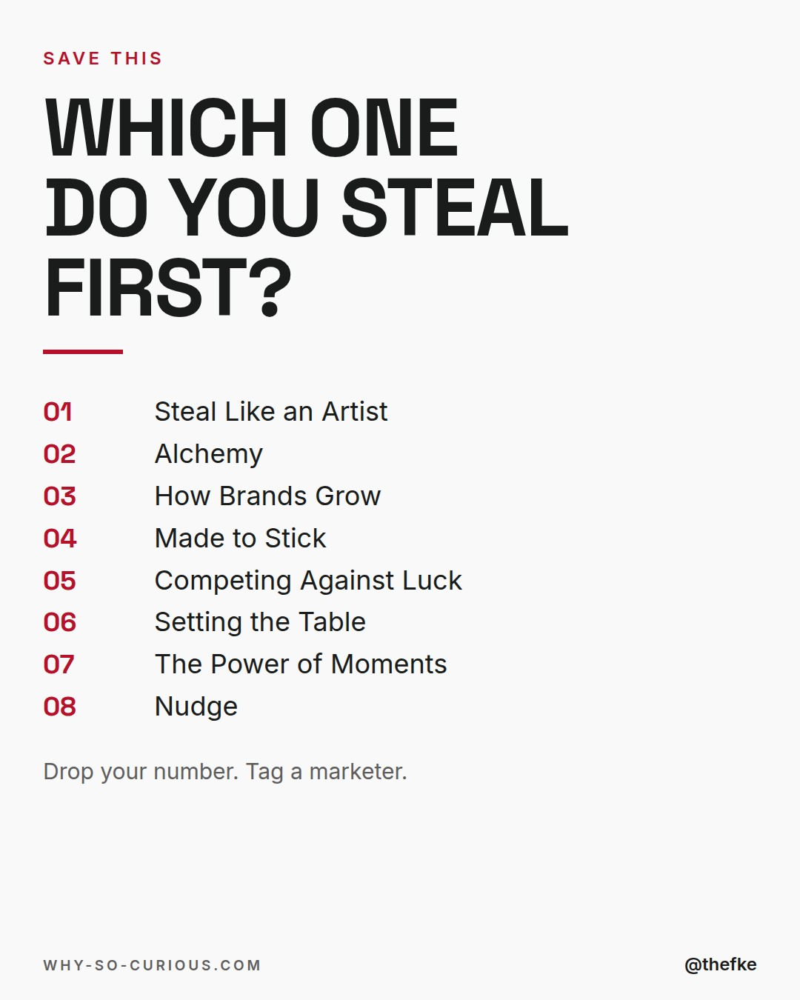

# Mi 18.11. · Books every marketer should steal from

Karussell, 10 Slides. Beim Hochladen 4:5 wählen.

## Caption

```
Good marketing ideas rarely start in marketing books.

I work as a fractional CMO.
These 8 books from my shelf are full of ideas worth stealing.

A restaurateur on hospitality.
A basketball star's stolen moves.
Why defaults steer choices.

Rory Sutherland in Alchemy:
"a flower is simply a weed with an advertising budget."

Which book do you steal from?

#books #bookstagram #bookrecommendations #reading #thefke #booklover #whysocurious
```

## Slides











