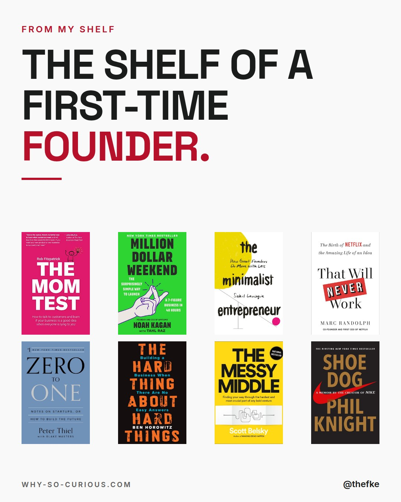
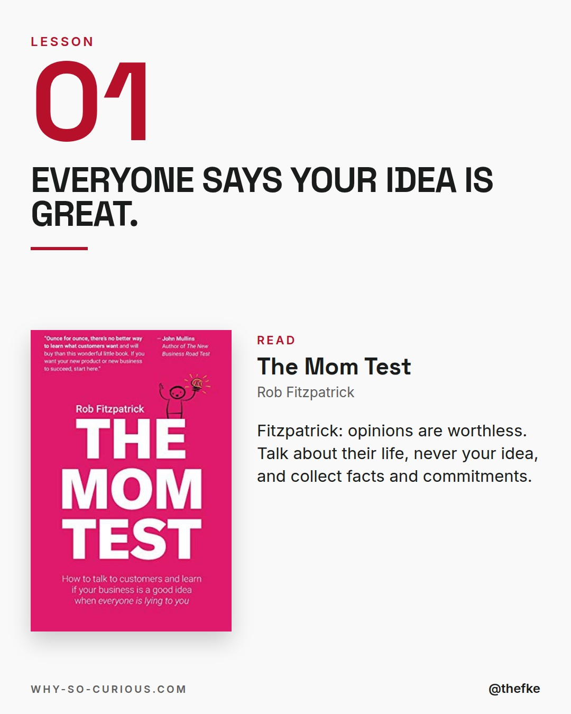
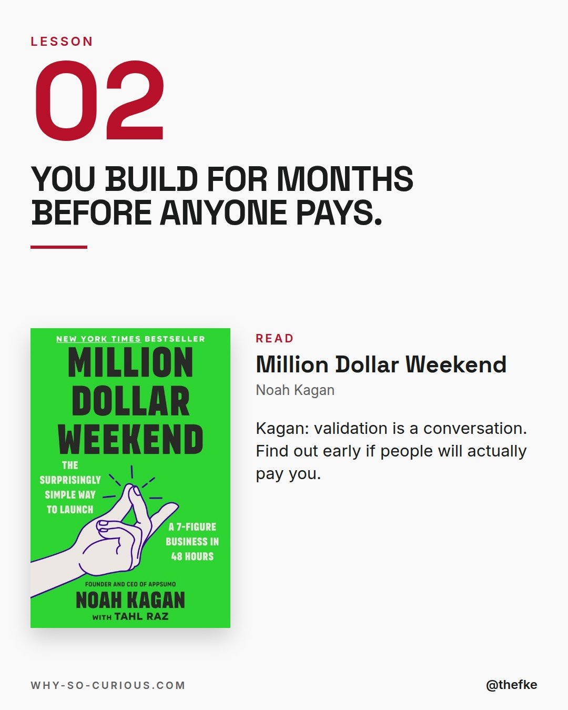
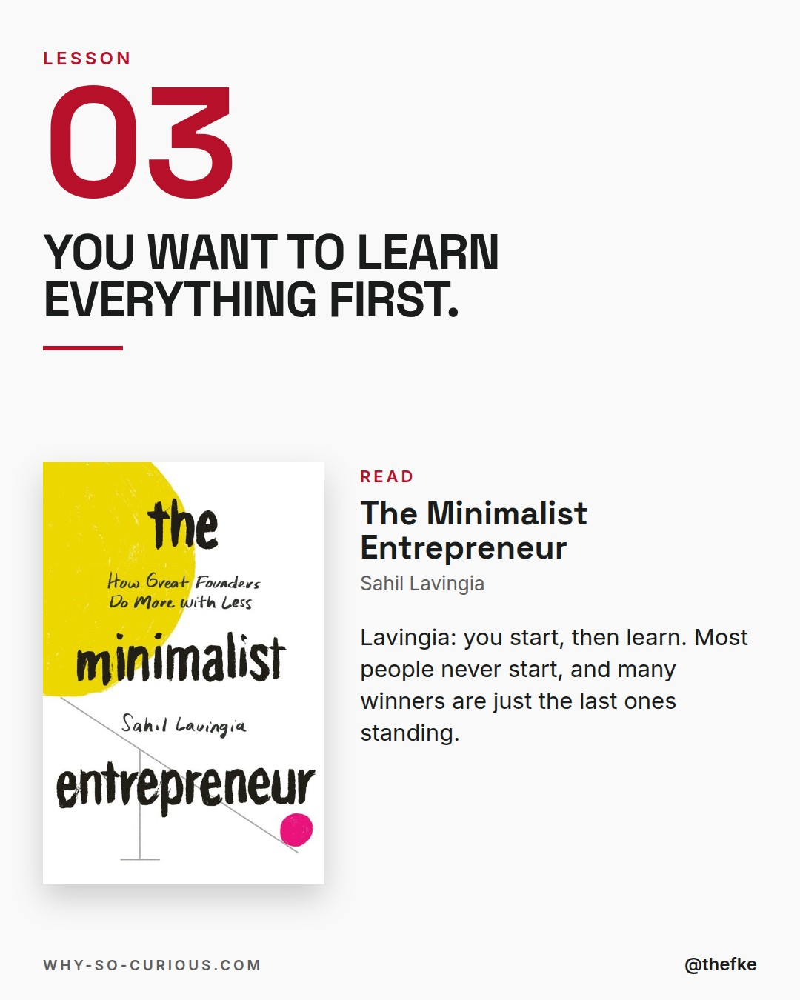
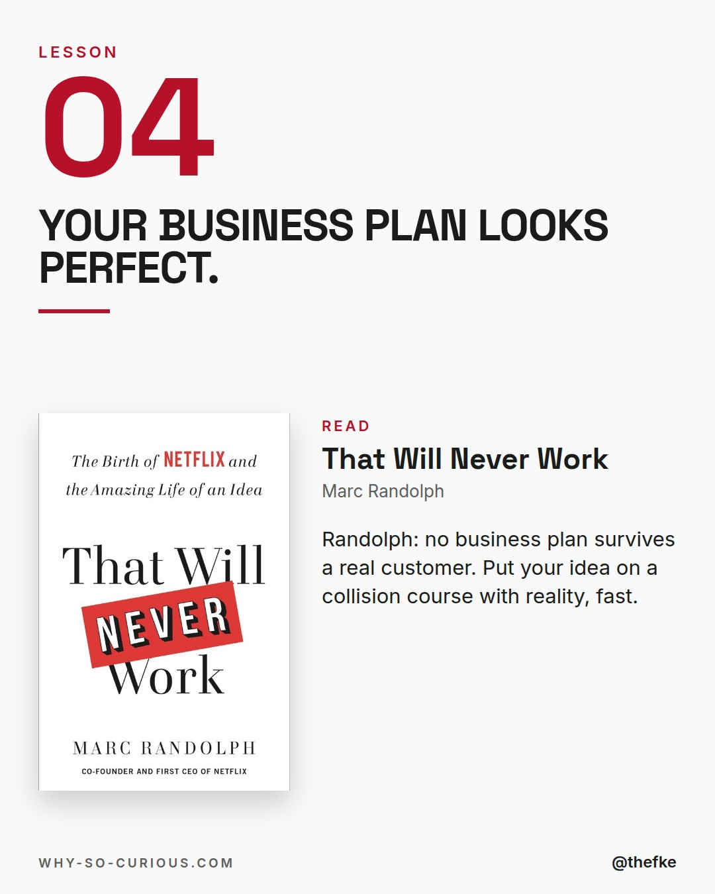
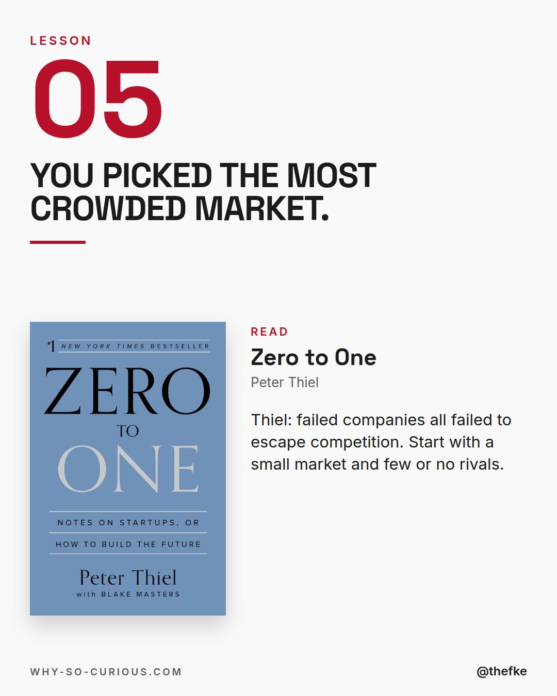
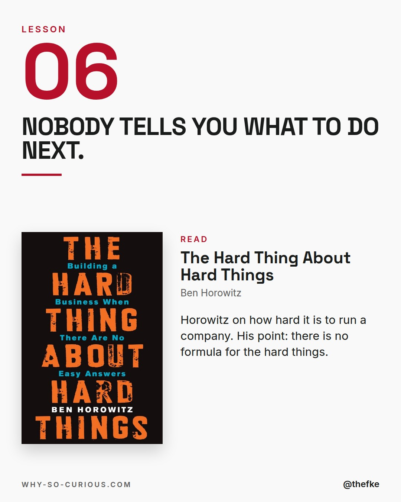
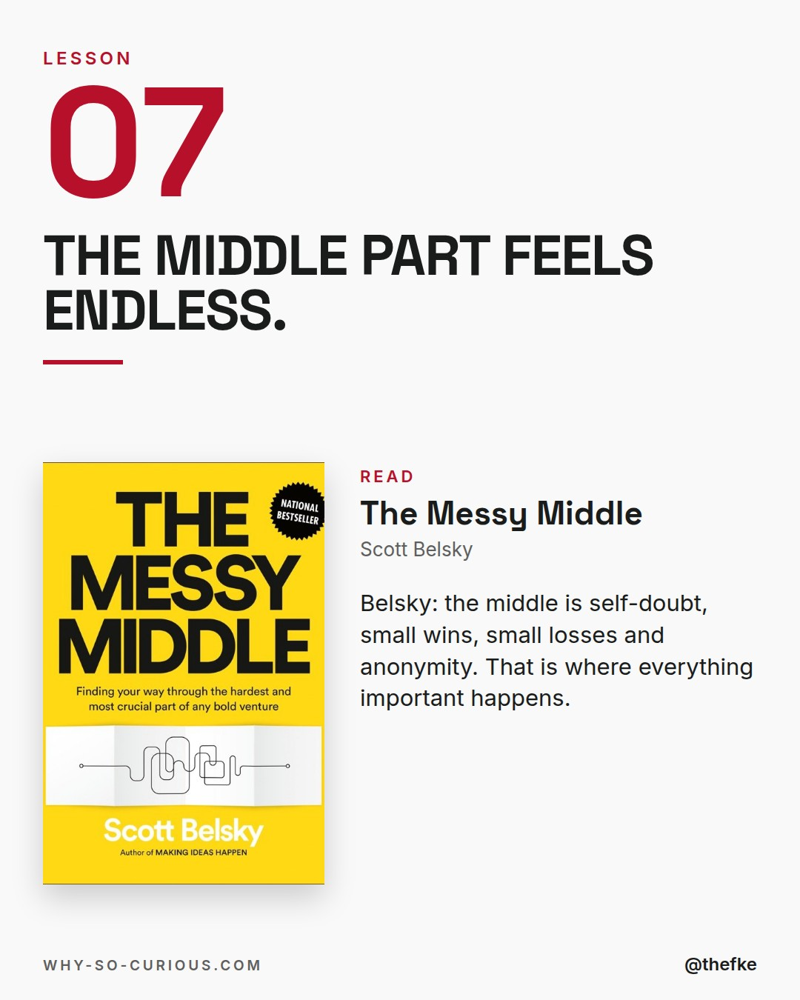
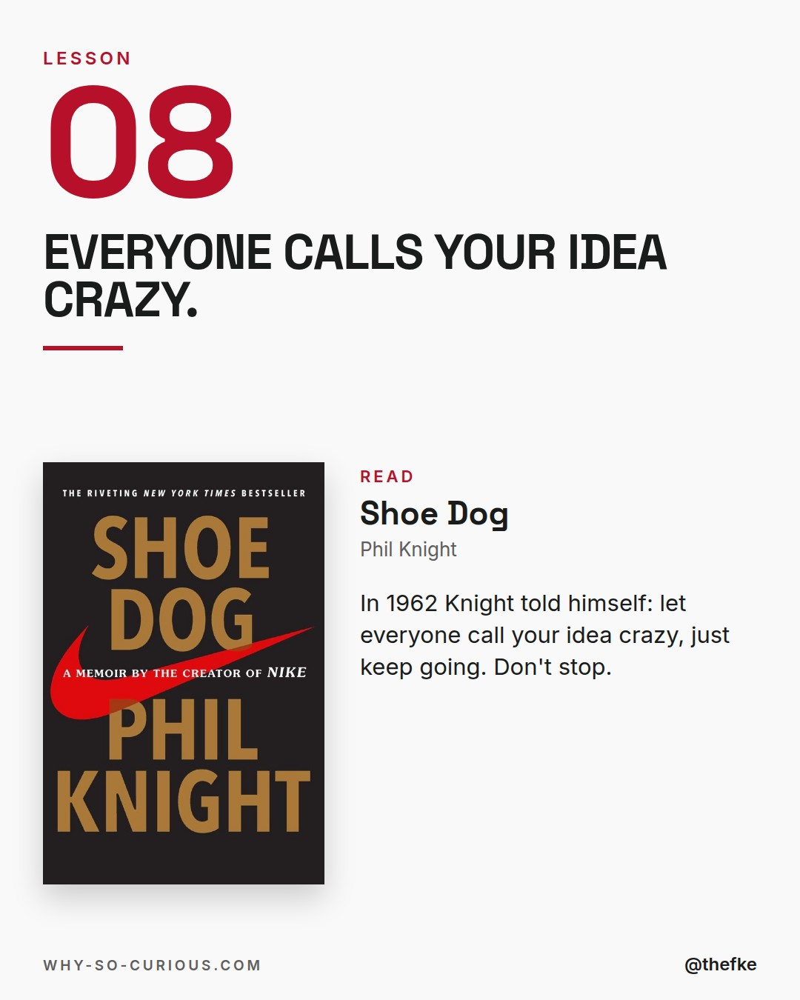
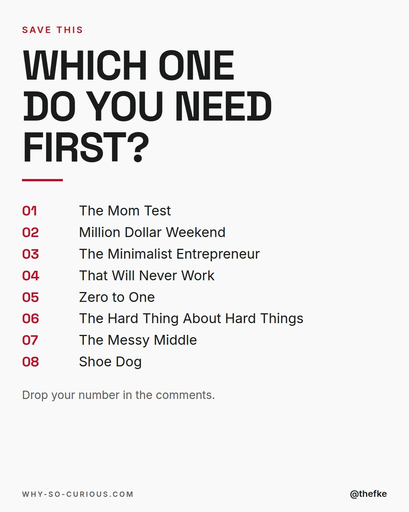

# Fr 20.11. · The shelf of a first-time founder

Karussell, 10 Slides. Beim Hochladen 4:5 wählen.

## Caption

```
Year one of a company is loud.
Everyone has an opinion on your idea.

8 books for a first-time founder.
From my shelf.

Talk to customers before you build.
Sell before it's perfect.
Expect the messy middle.

Rob Fitzpatrick in The Mom Test:
"opinions are worthless. You want facts and commitments, not compliments."

Which one would you hand a founder first?

#books #bookstagram #bookrecommendations #reading #thefke #booklover #whysocurious
```

## Slides











