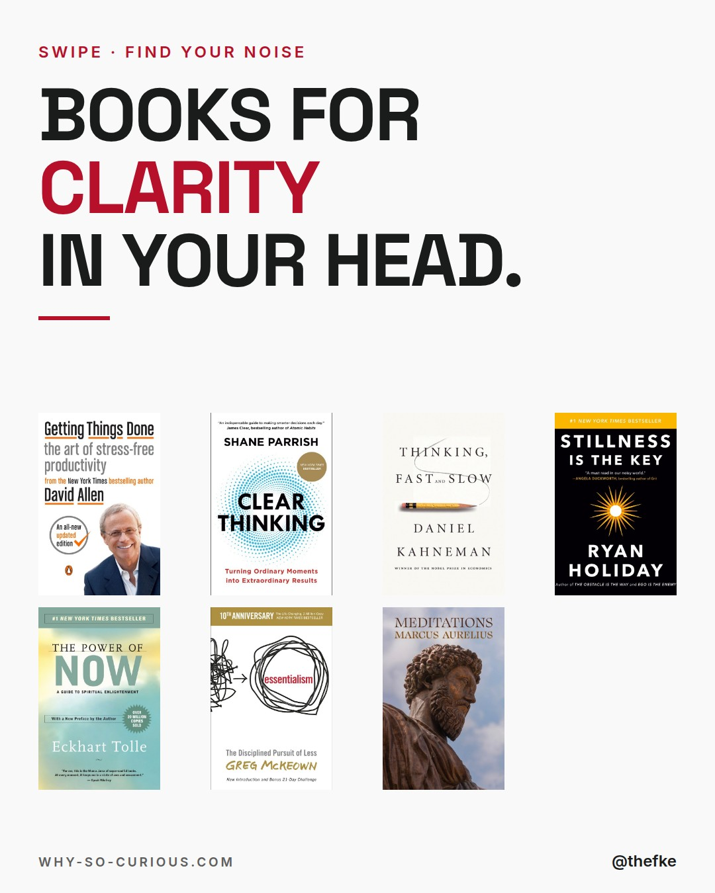
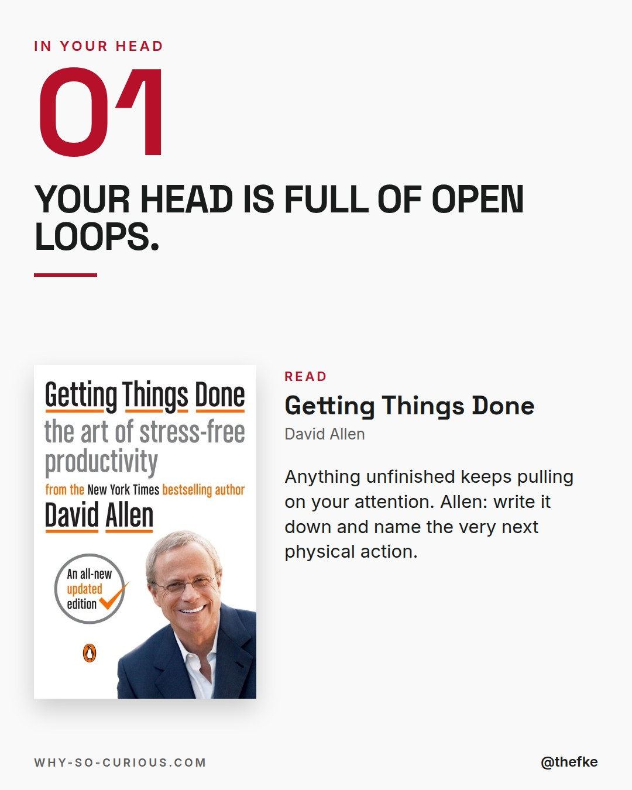
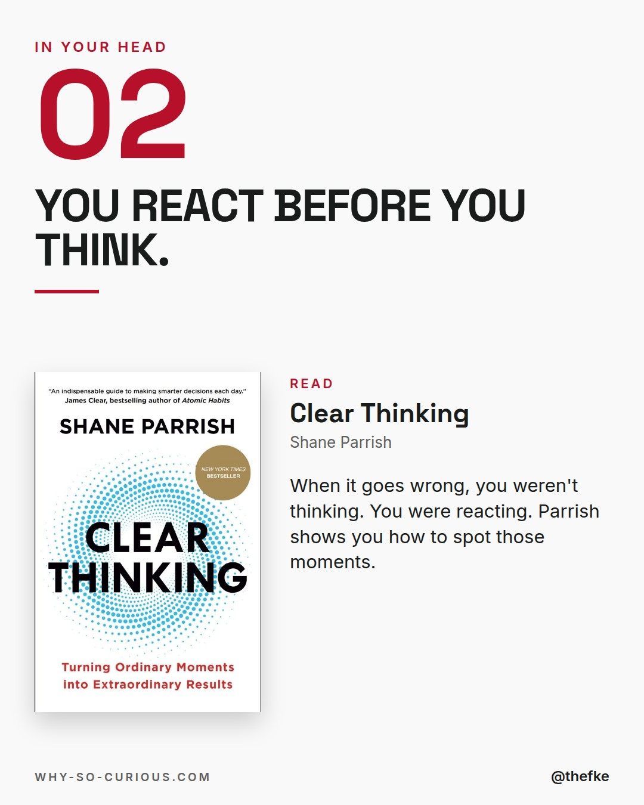
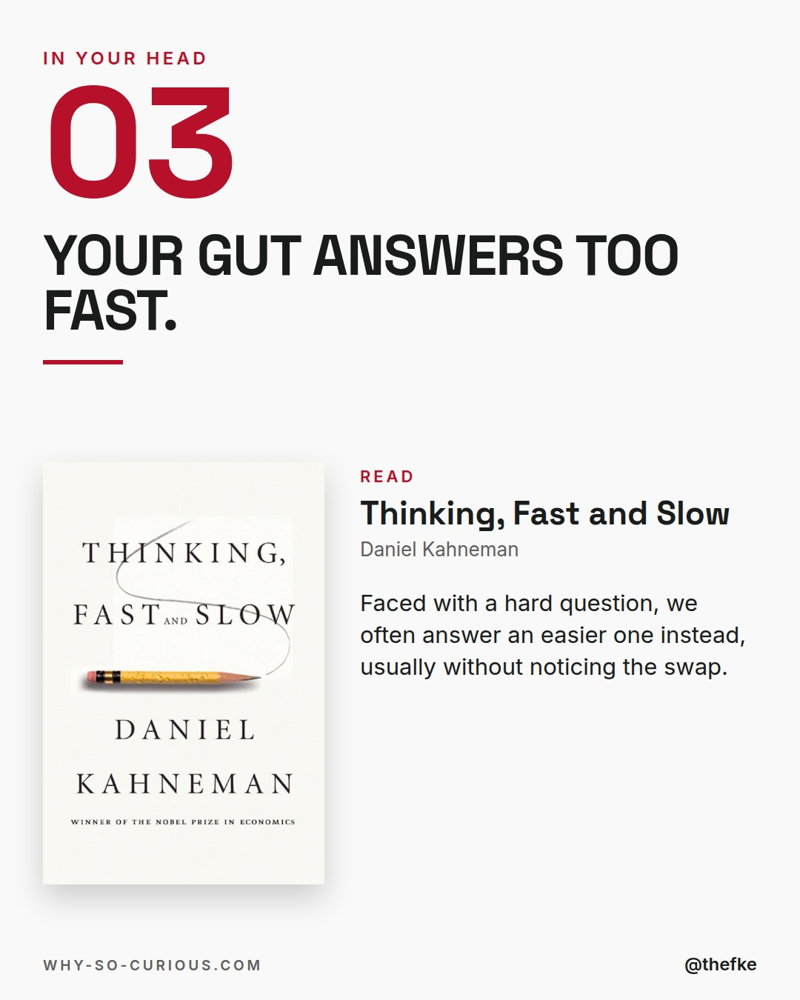
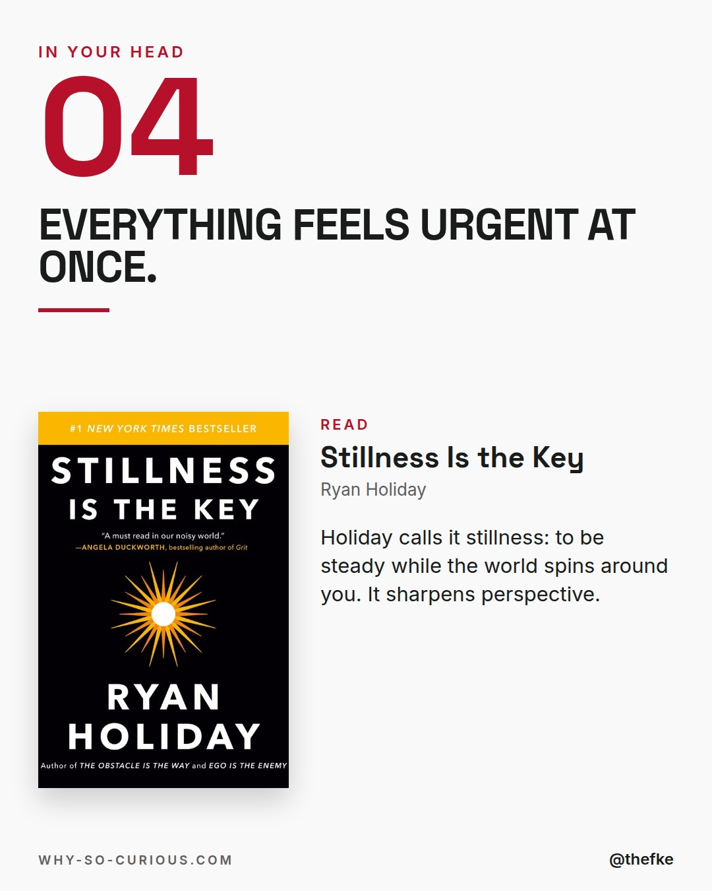
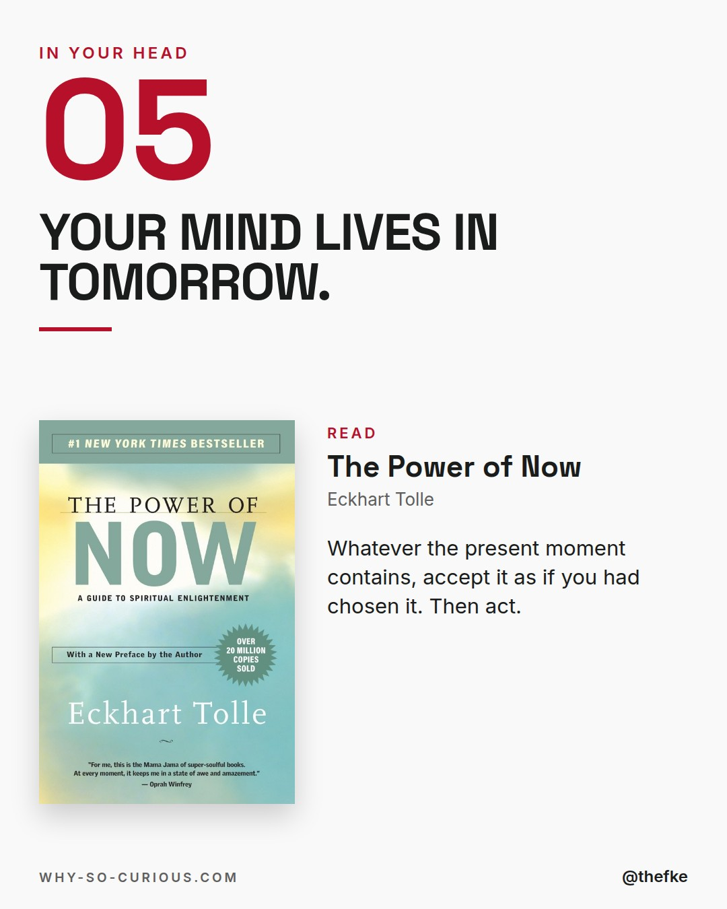
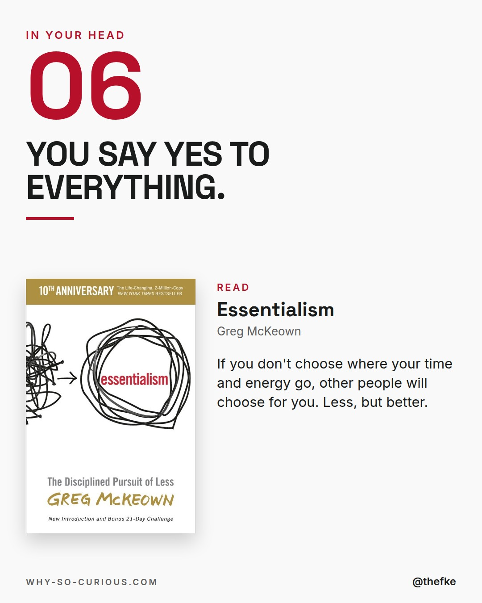
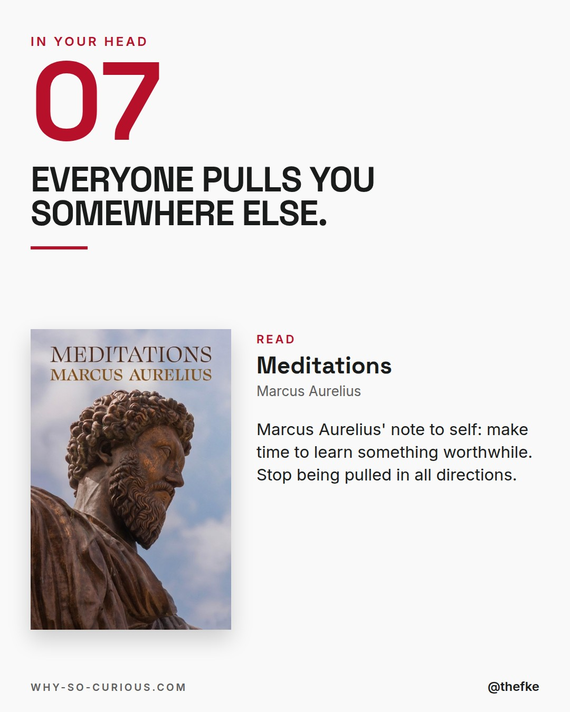
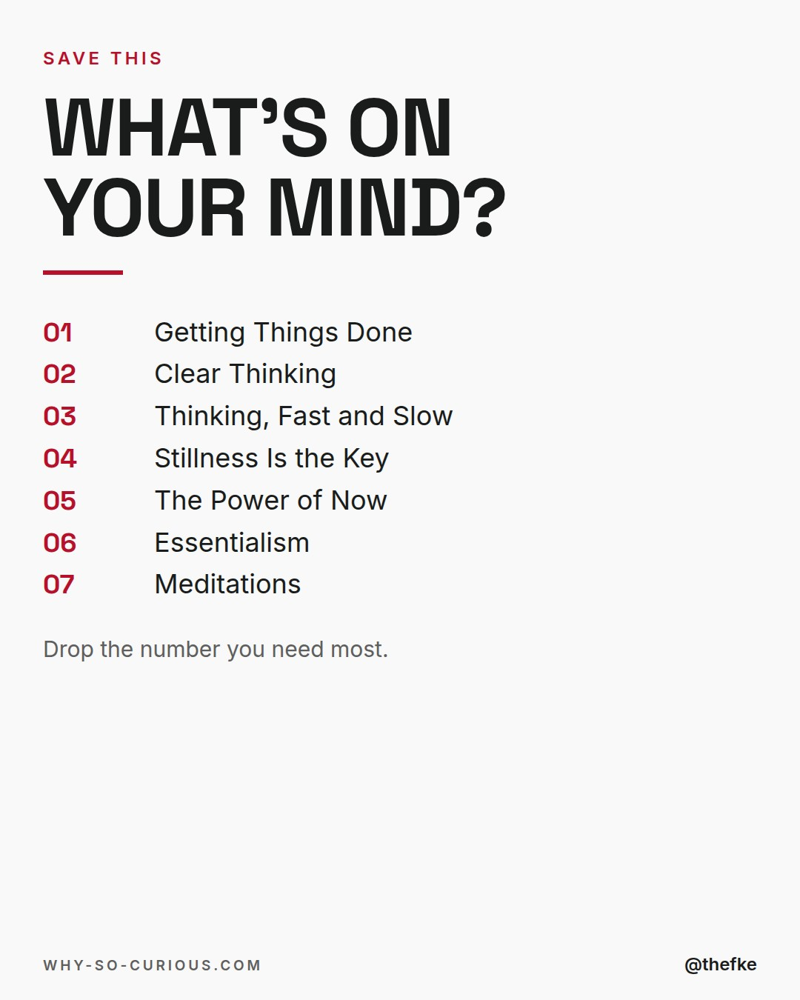

# Mo 23.11. · Books for clarity in your head

Karussell, 9 Slides. Beim Hochladen 4:5 wählen.

## Caption

```
Too many tabs open.
In the browser and in your head.

Seven books for clarity.
One noise each.

David Allen in Getting Things Done:
“Anything that does not belong where it is, the way it is, is an “open loop,” which will be pulling on your attention if it’s not appropriately managed.”

Save it for the next loud day.

Which number sounds like your head right now?

#books #bookstagram #bookrecommendations #reading #thefke #booklover #whysocurious
```

## Slides










