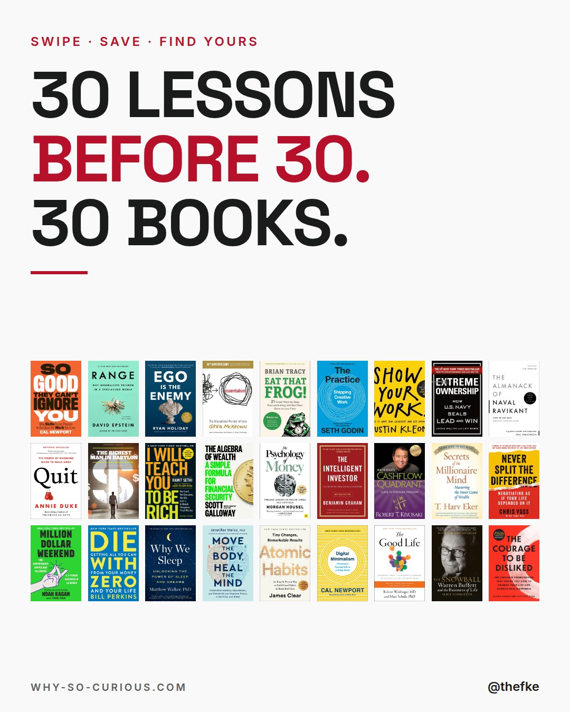
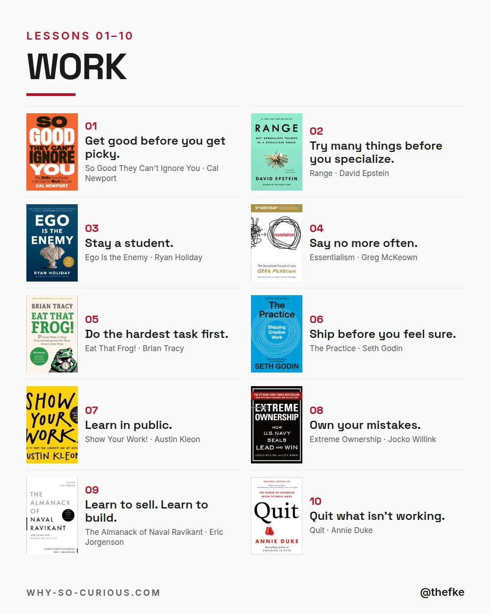
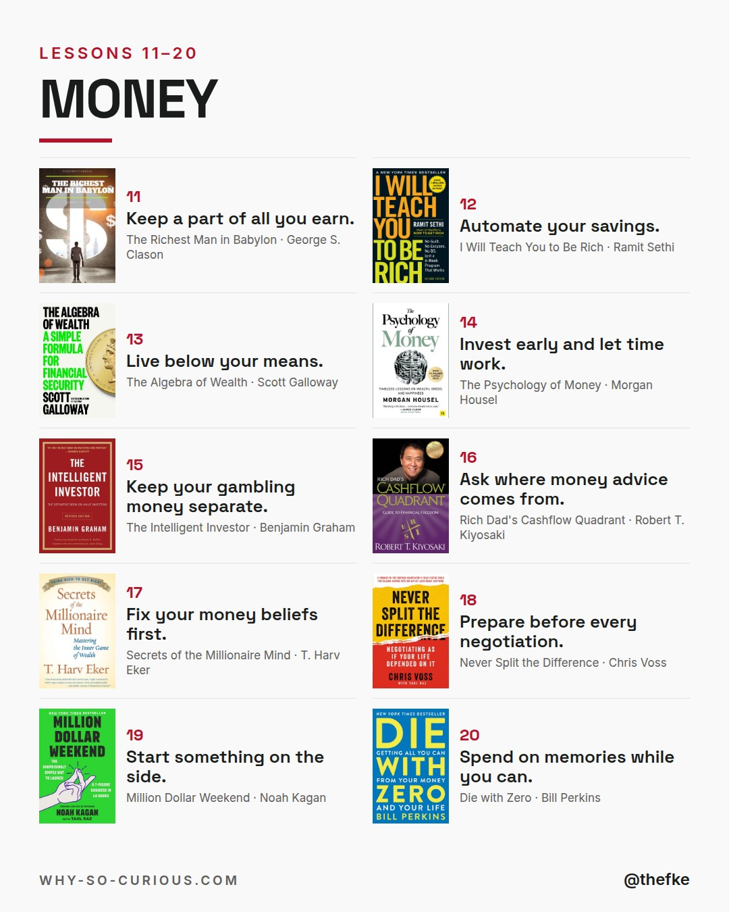
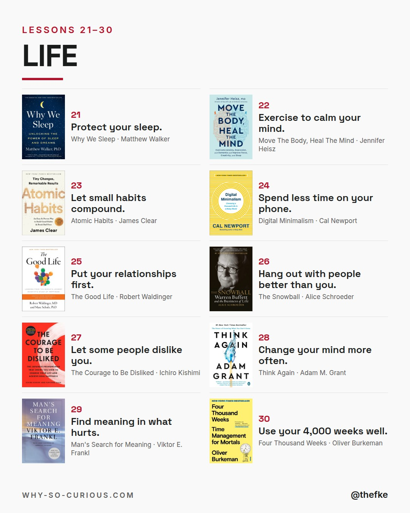
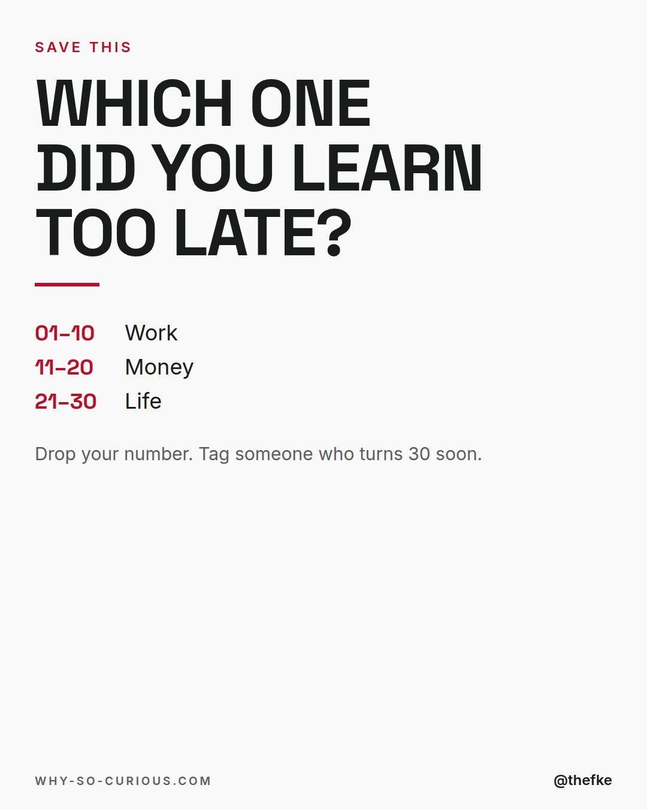

# Mo 30.11. · 30 Lessons Before 30

Karussell, 5 Slides. Beim Hochladen 4:5 wählen.

## Caption

```
30 lessons before 30.
30 books that teach them.

Work, money, life.
10 each.

Oliver Burkeman did the math.
If you live to 80, you get about 4,000 weeks.
By 30, you've used more than 1,500.

Save it.
Tag someone who turns 30 soon.

Which one do you wish you'd known earlier?

#books #bookstagram #bookrecommendations #reading #thefke #booklover #whysocurious
```

## Slides






