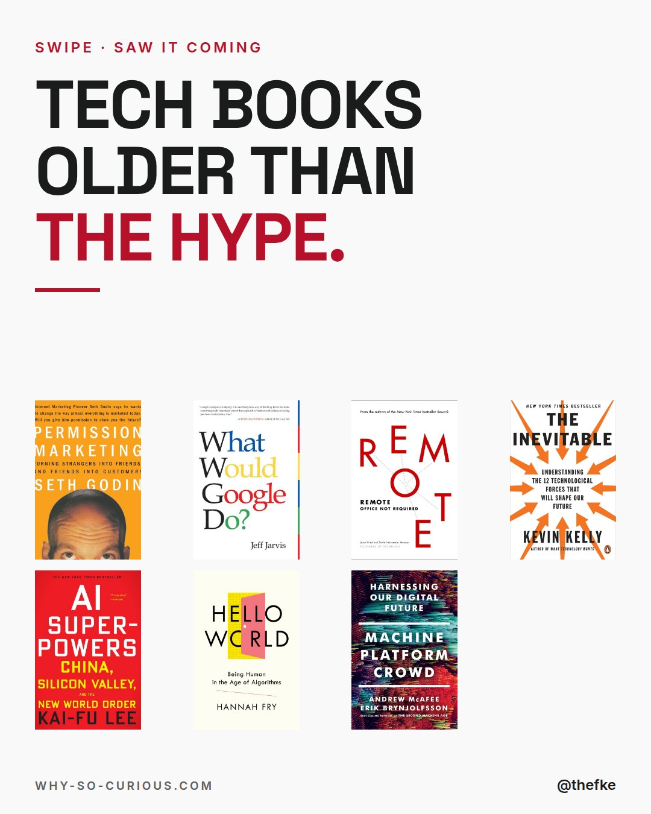
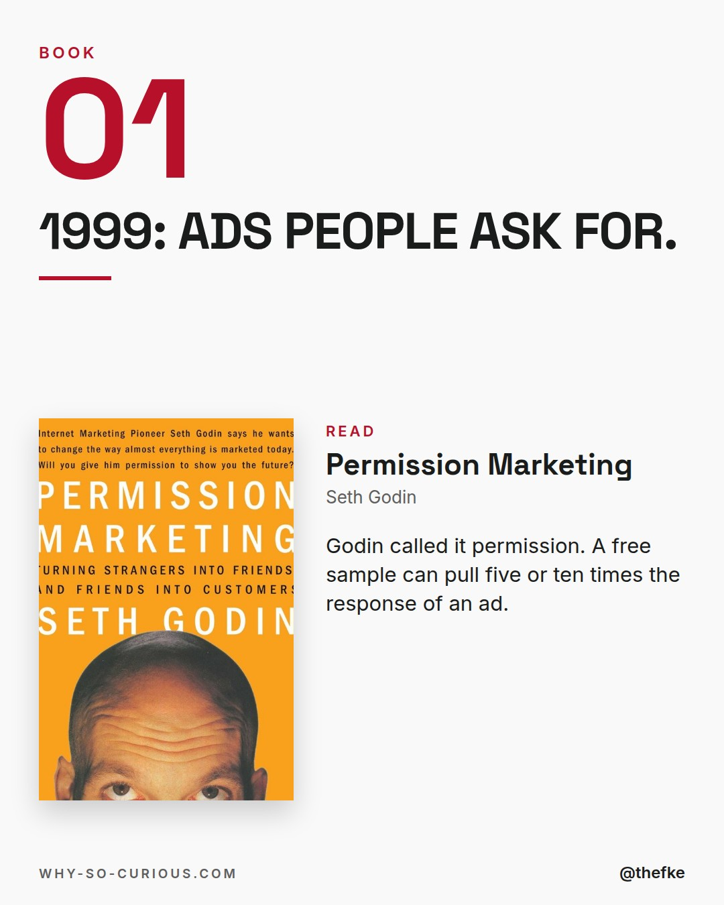
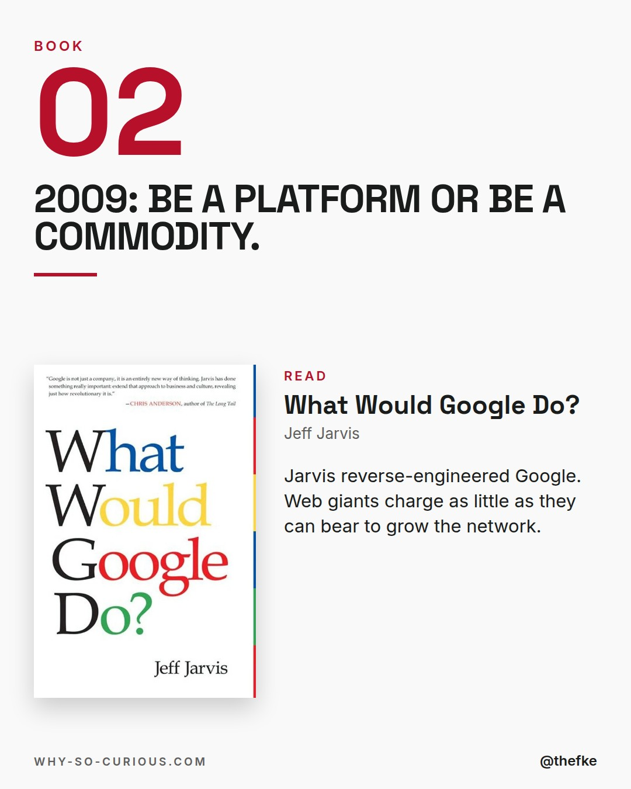
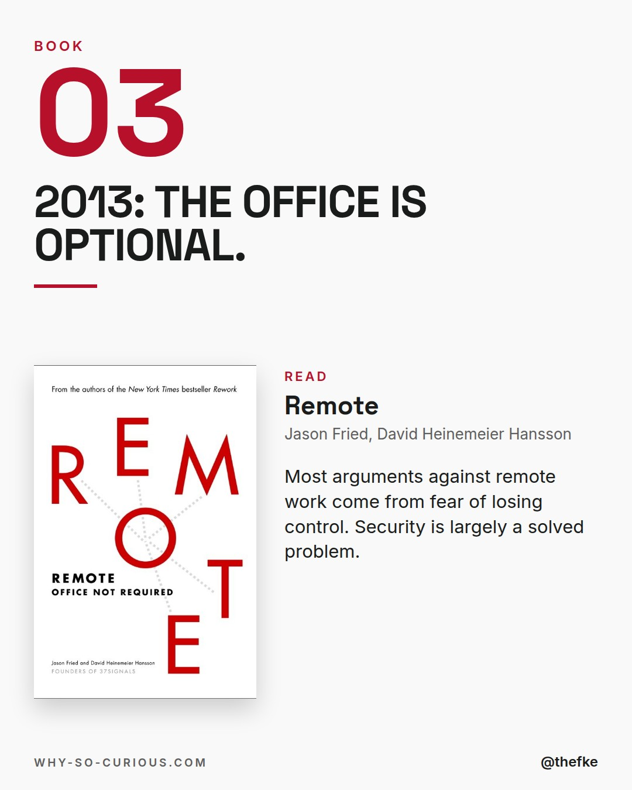
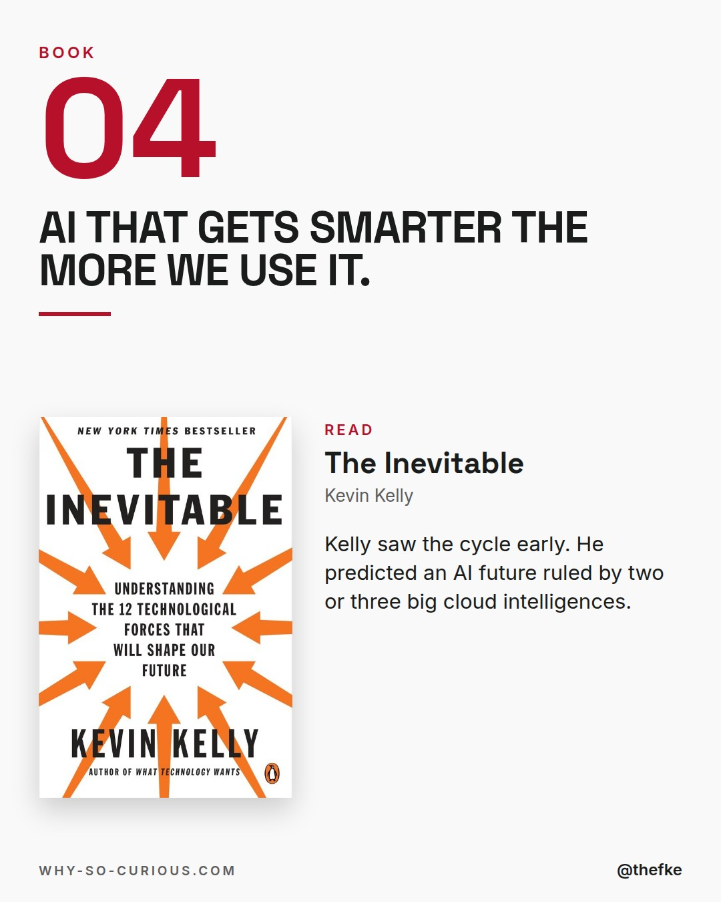
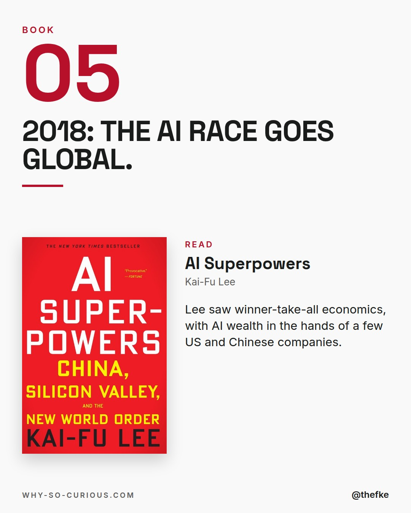
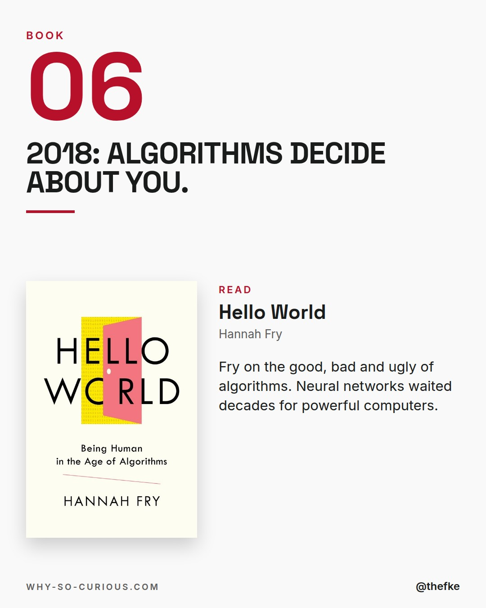
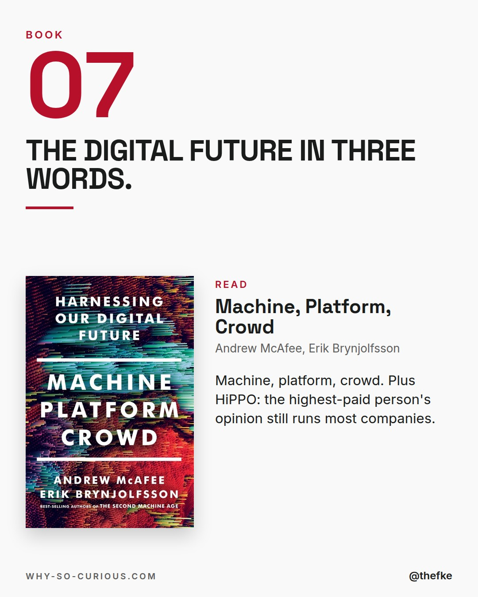
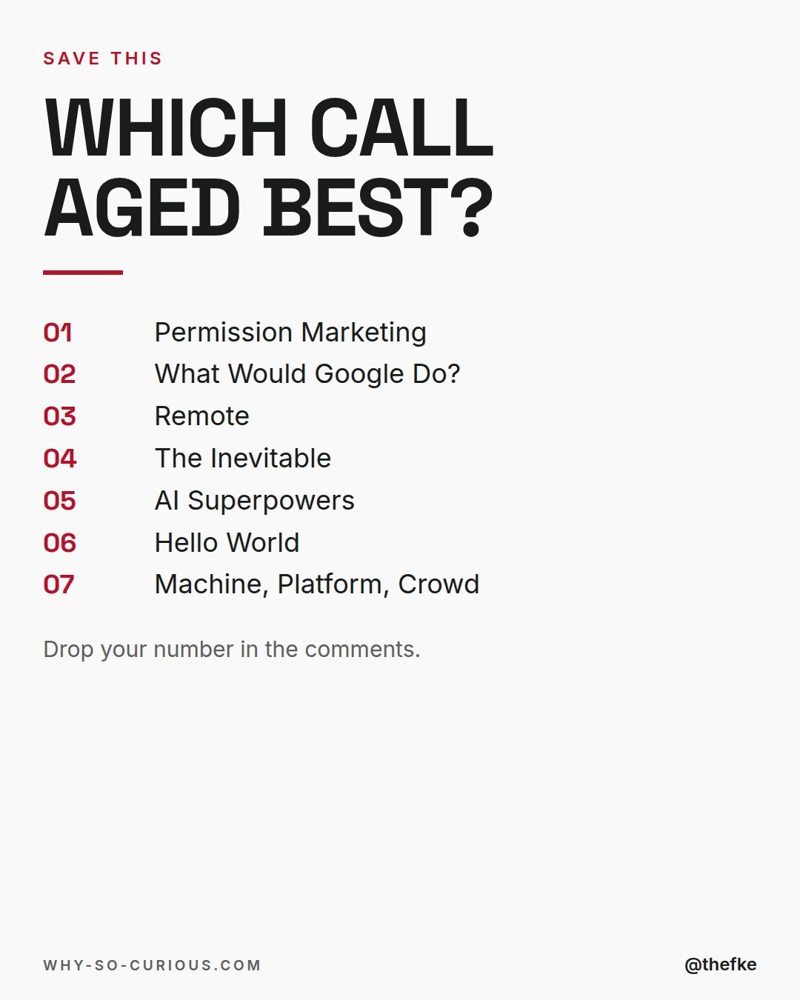

# Di 01.12. · Tech books older than the hype

Karussell, 9 Slides. Beim Hochladen 4:5 wählen.

## Caption

```
Everyone talks about AI and platforms like they arrived last year.
These books were there first.

Seven of them, written before the hype.
Permission. Platforms. Remote work. AI at scale.

Kevin Kelly wrote that our AI future would be ruled by
"an oligarchy of two or three large, general-purpose cloud-based commercial intelligences."
Read that again in 2026.

All from my shelf.

Which prediction aged best?

#books #bookstagram #bookrecommendations #reading #thefke #booklover #whysocurious
```

## Slides










