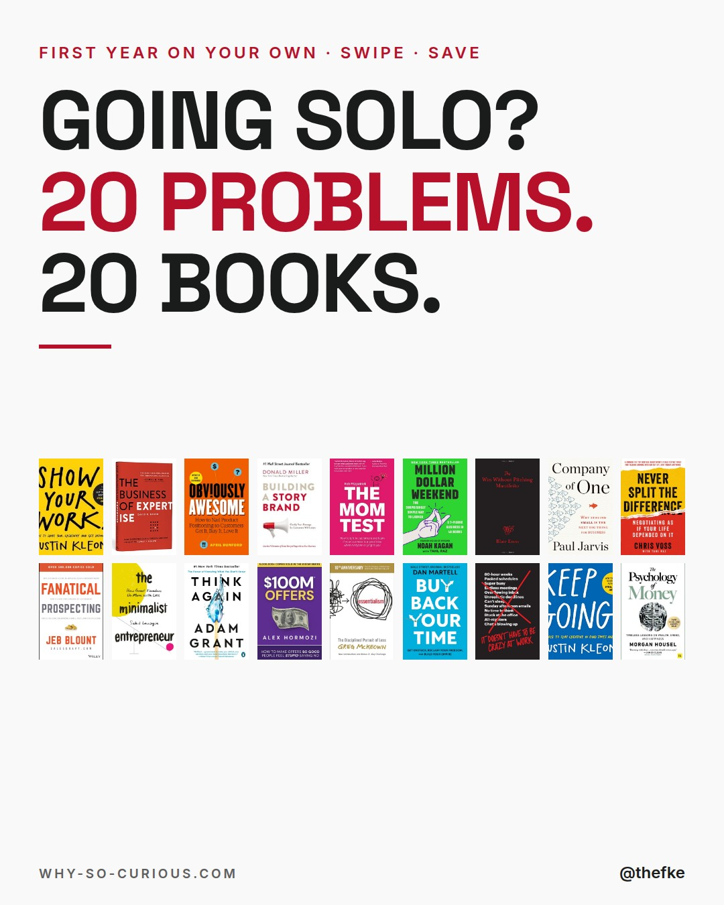
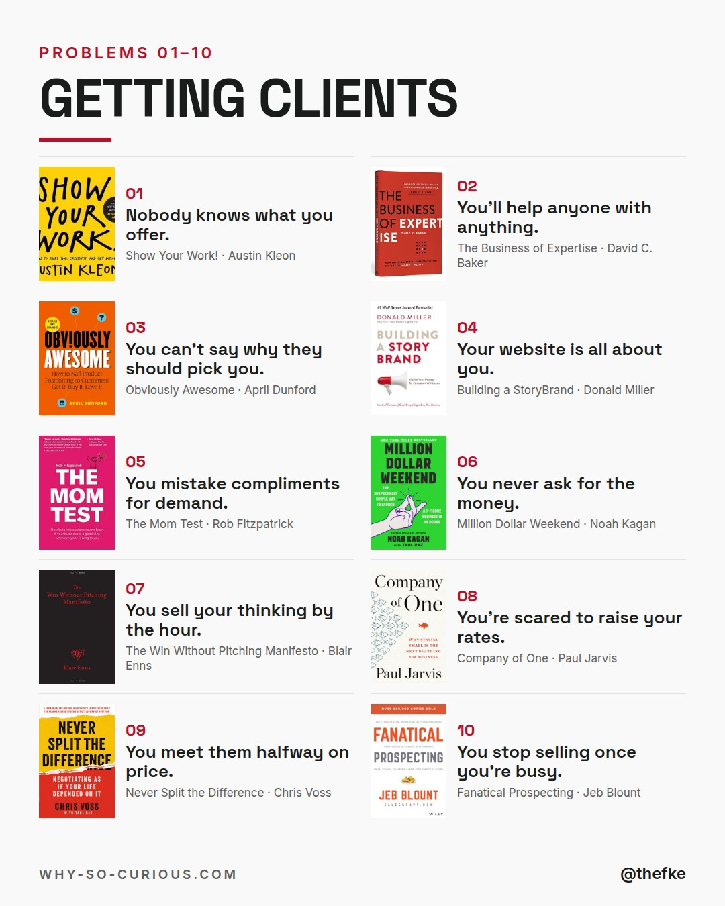
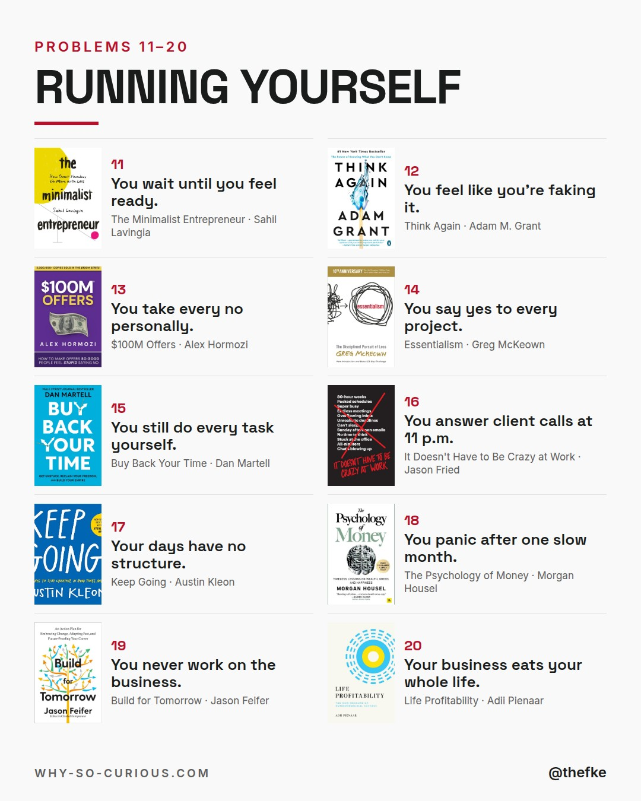
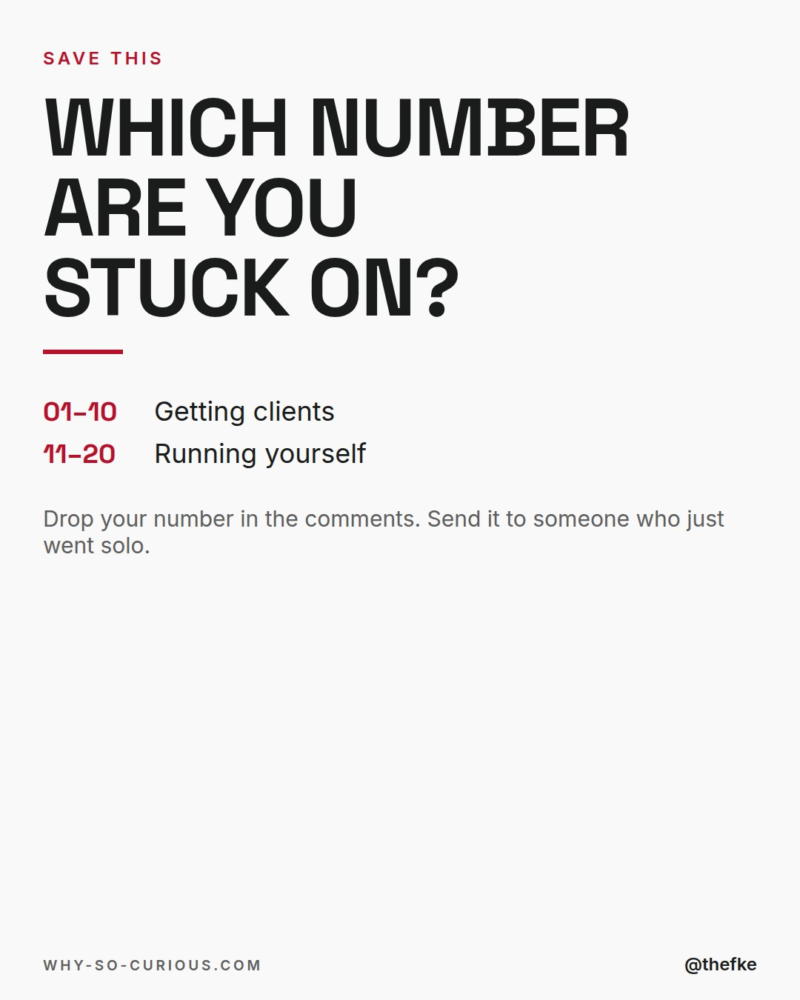

# So 06.12. · Going Solo? 20 Problems

Karussell, 4 Slides. Beim Hochladen 4:5 wählen.

## Caption

```
Going solo sounds like freedom.
Then year one starts.

20 problems that come with working on your own.
20 books from my shelf that help.

10 about getting clients.
10 about running yourself.

Paul Jarvis in Company of One:
“I doubled my rates over and over until the demand only slightly exceeded the time I had available to do the work.”

I'm in my first year on my own.
Save it. Send it to someone who just went solo.

Which number are you stuck on?

#books #bookstagram #bookrecommendations #reading #thefke #booklover #whysocurious
```

## Slides





