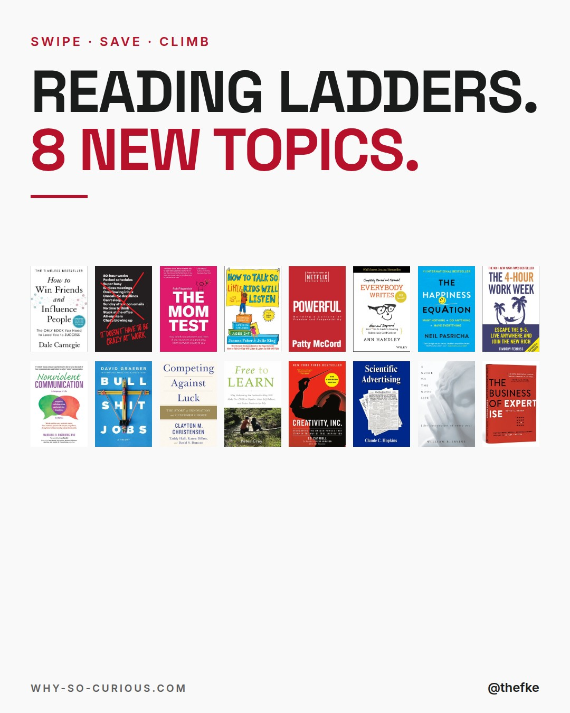
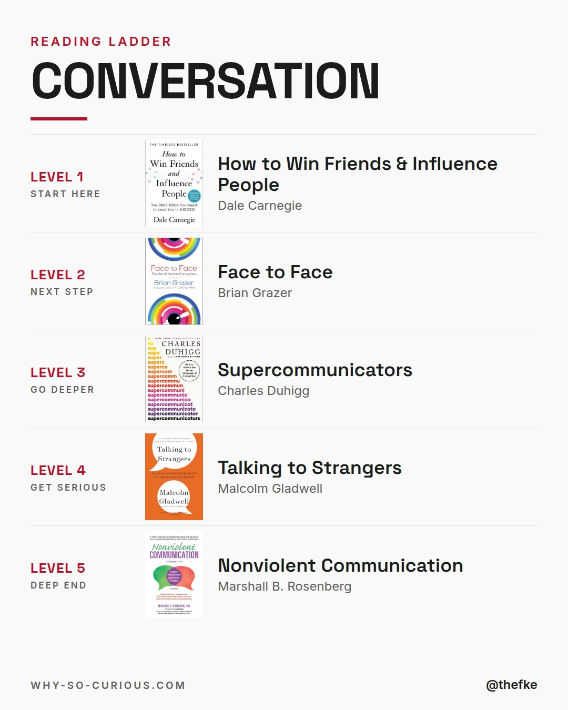
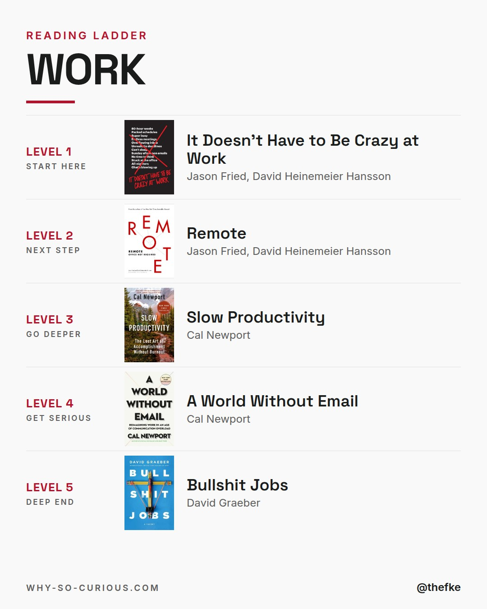
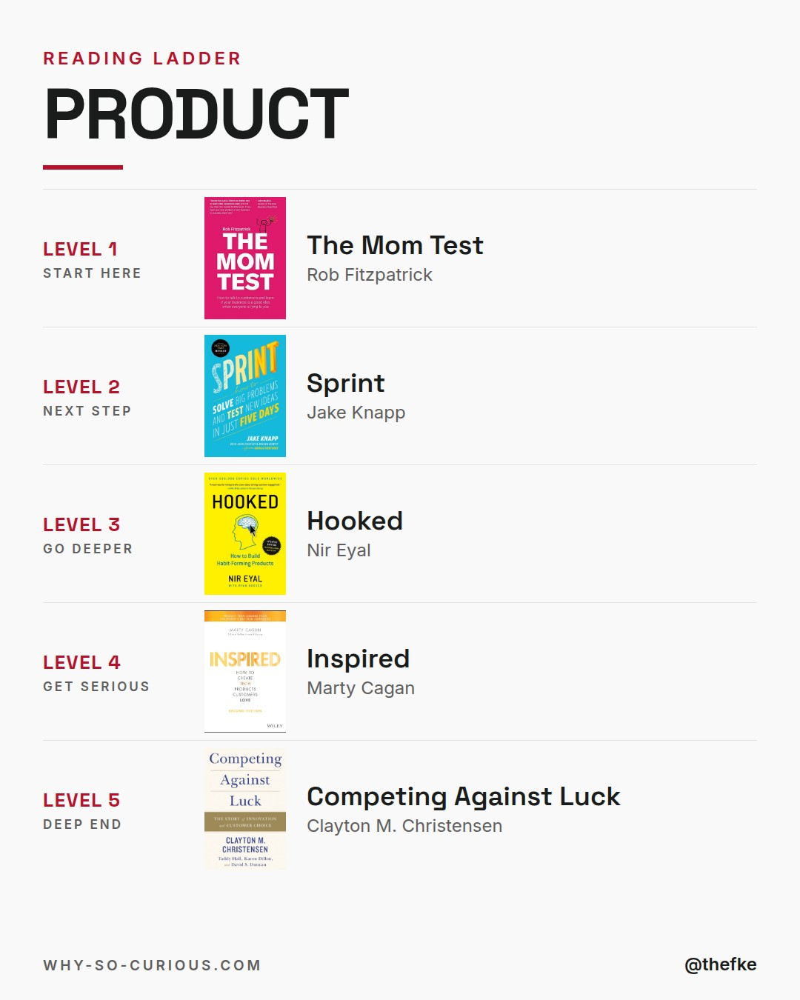
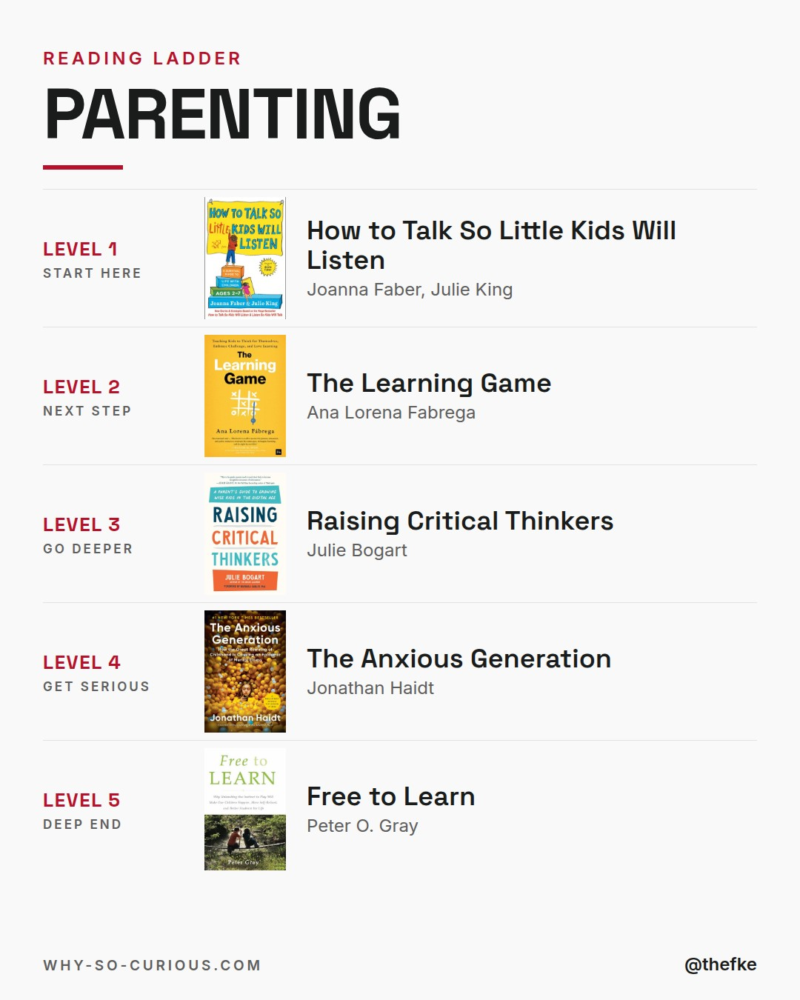
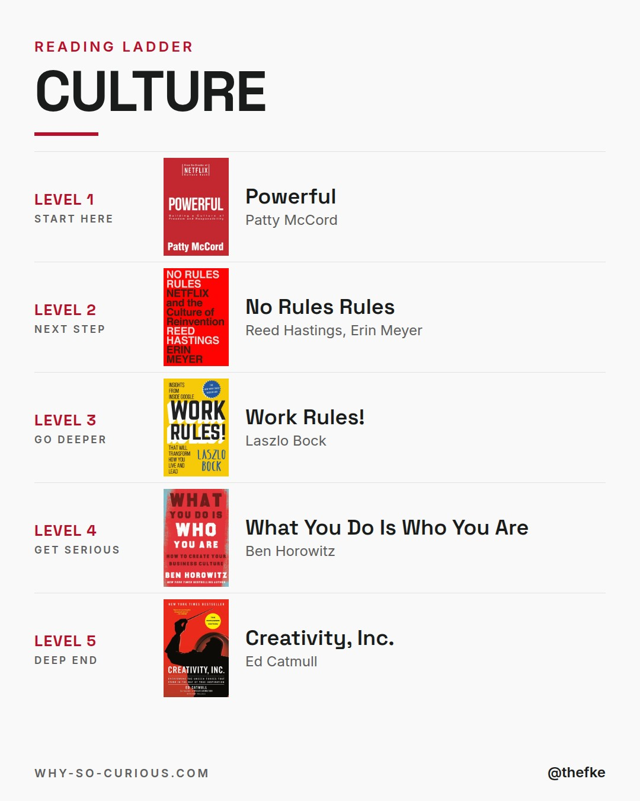
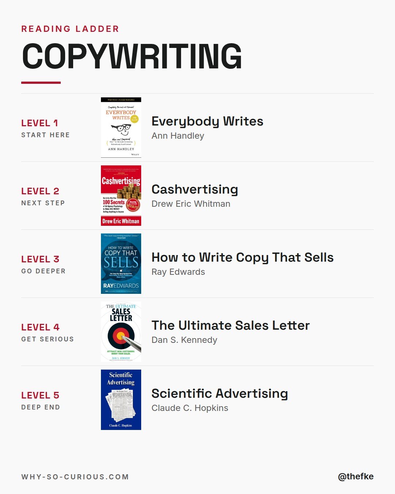
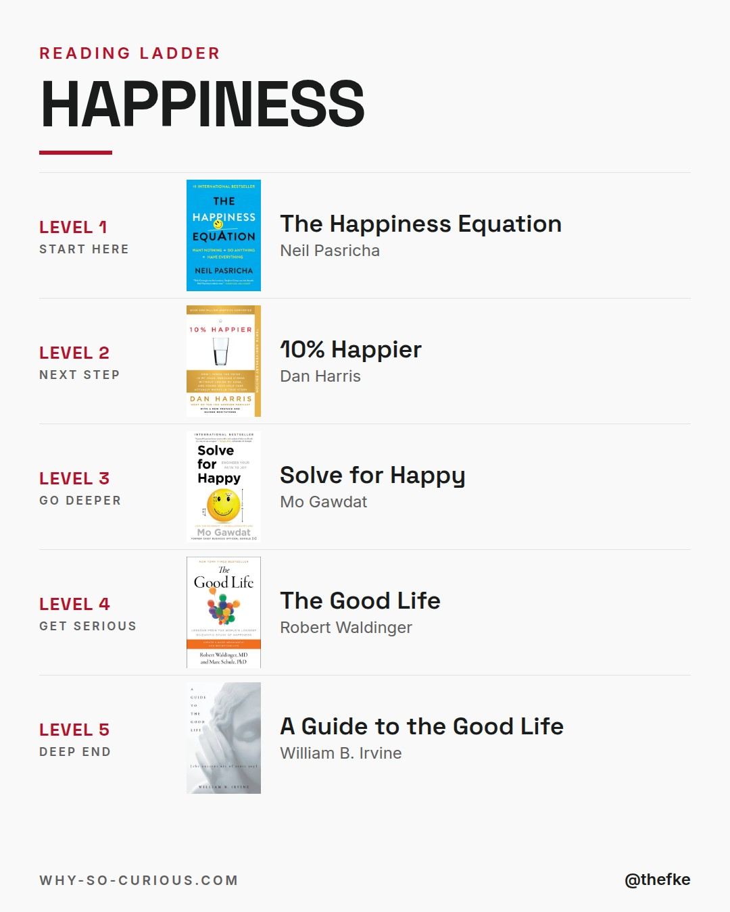
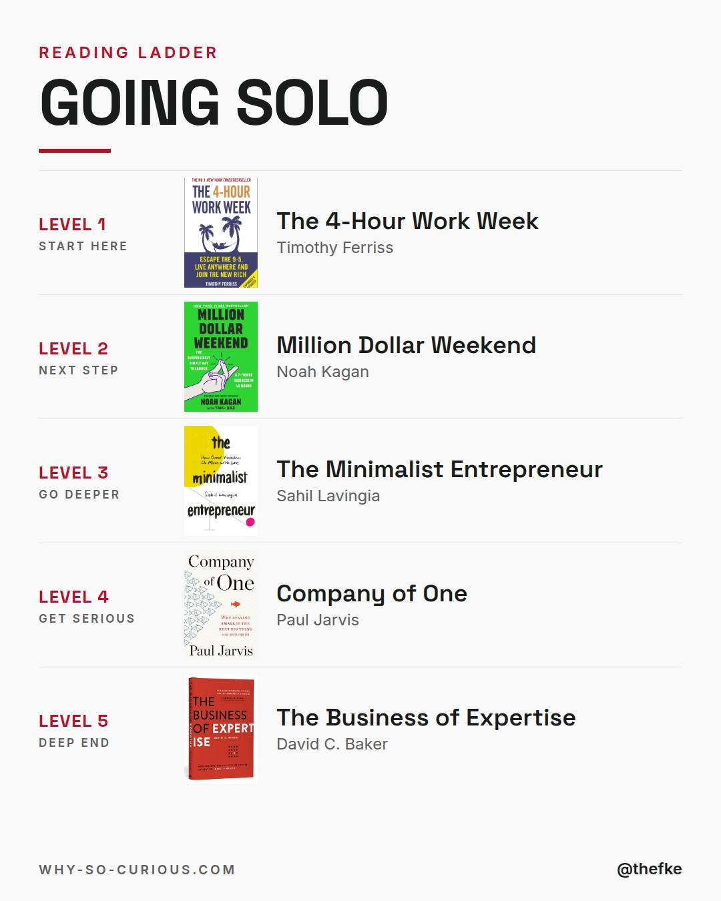
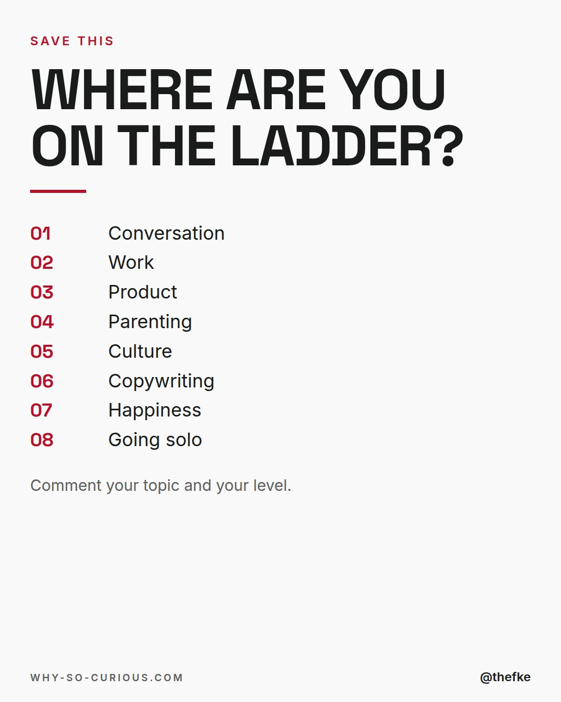

# Do 10.12. · Reading Ladders, Part 3

Karussell, 10 Slides. Beim Hochladen 4:5 wählen.

## Caption

```
Reading ladders, part 3.

Conversation, work, product, parenting.
Culture, copywriting, happiness, going solo.

5 levels each.
Level 1 gets you in. Level 5 is the deep end.

The happiness ladder starts with Neil Pasricha:
“Happy people don’t have the best of everything. They make the best of everything. Be happy first.”
It ends with the Stoics.

All 40 books from my shelf.

Save it and climb one step at a time.

Which topic, which level?

#books #bookstagram #bookrecommendations #reading #thefke #booklover #whysocurious
```

## Slides











