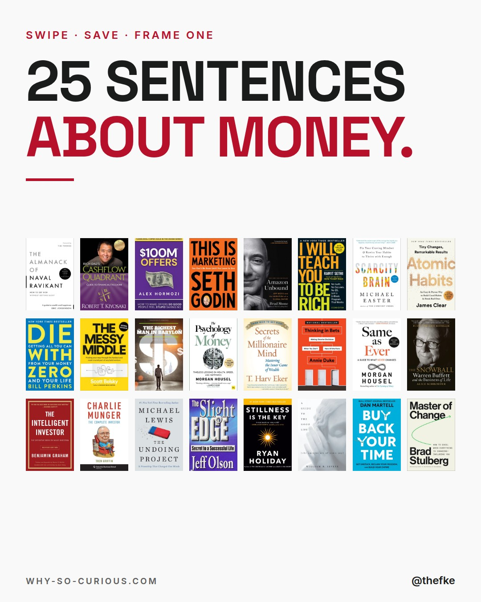
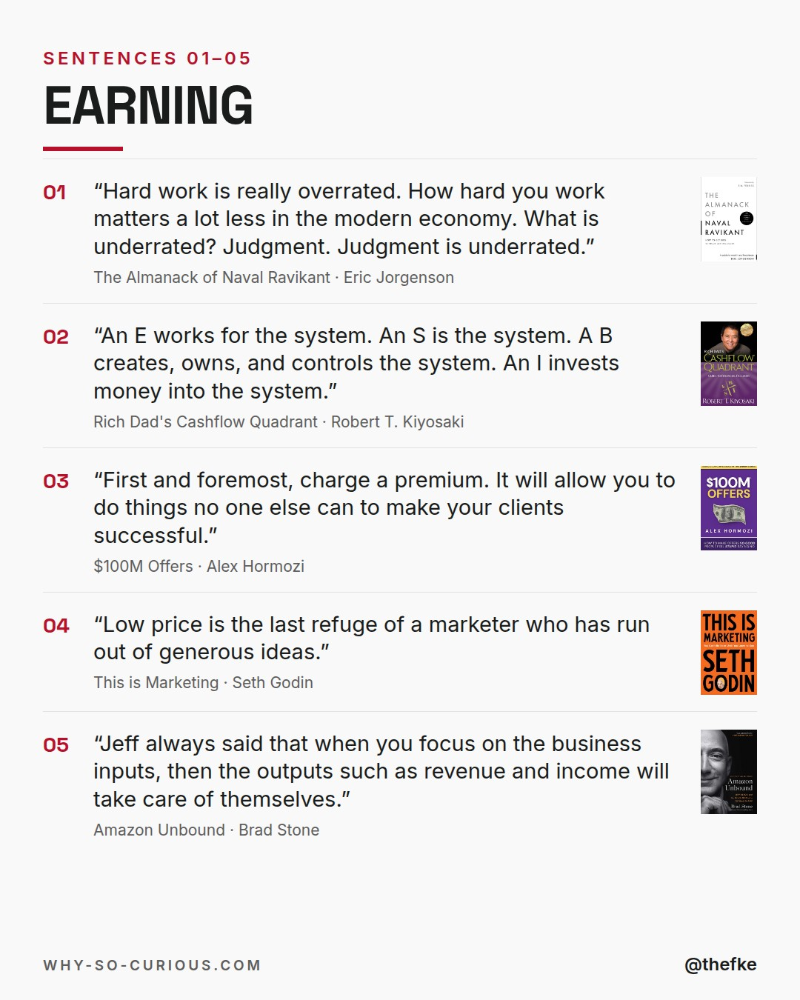
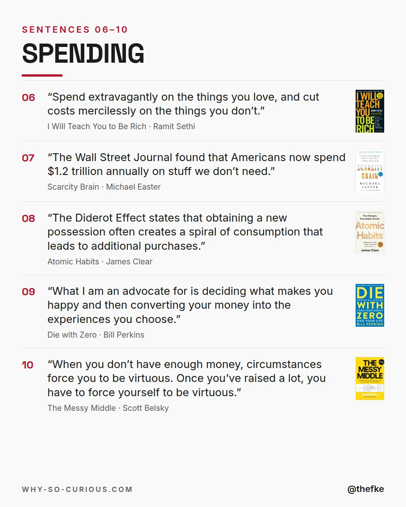
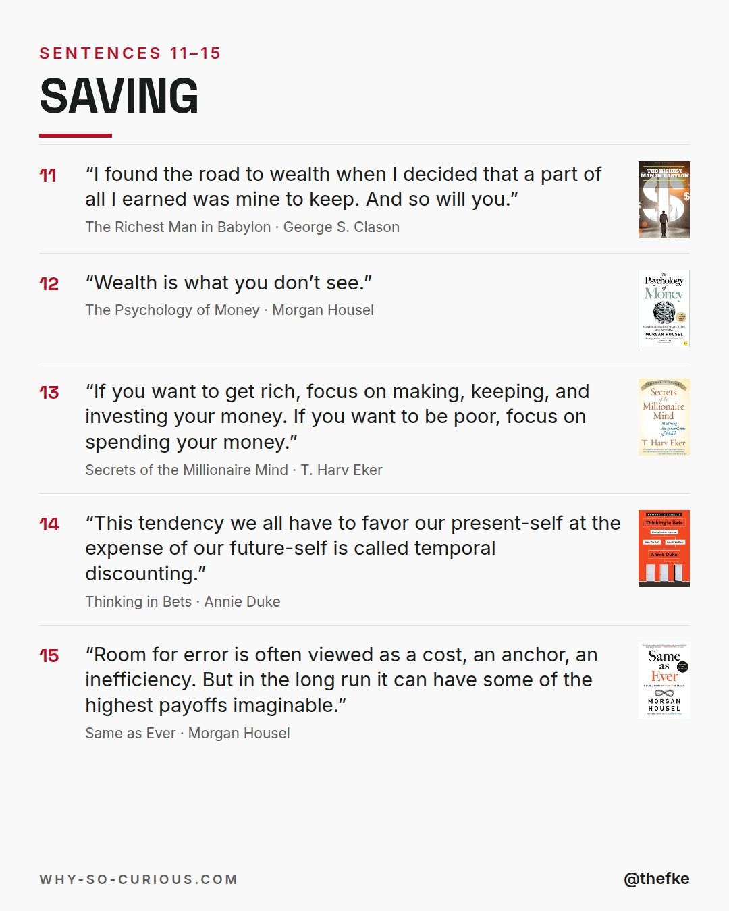
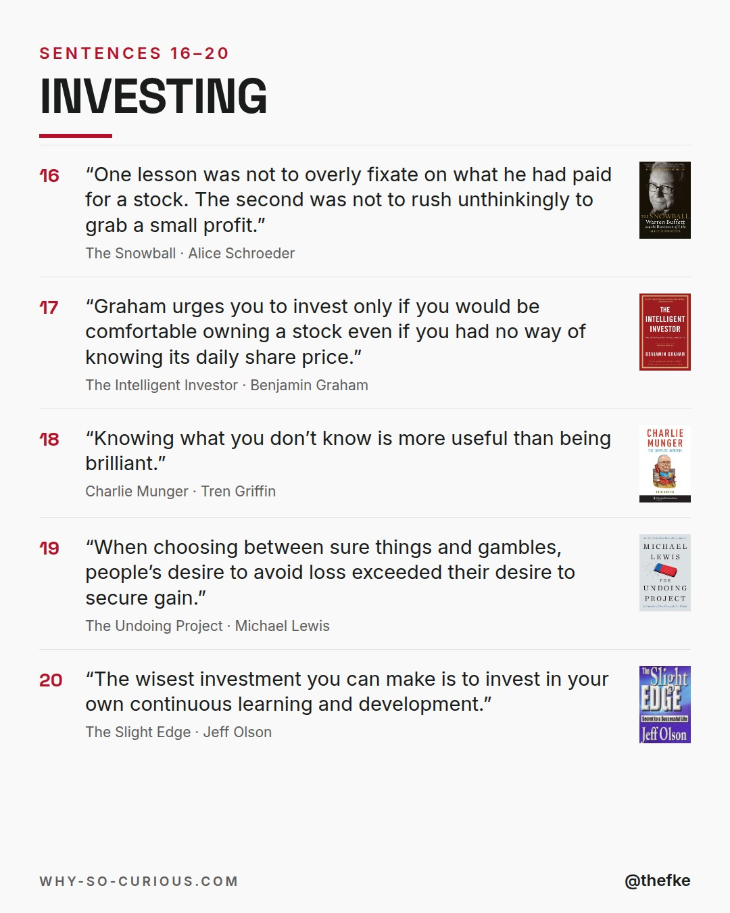
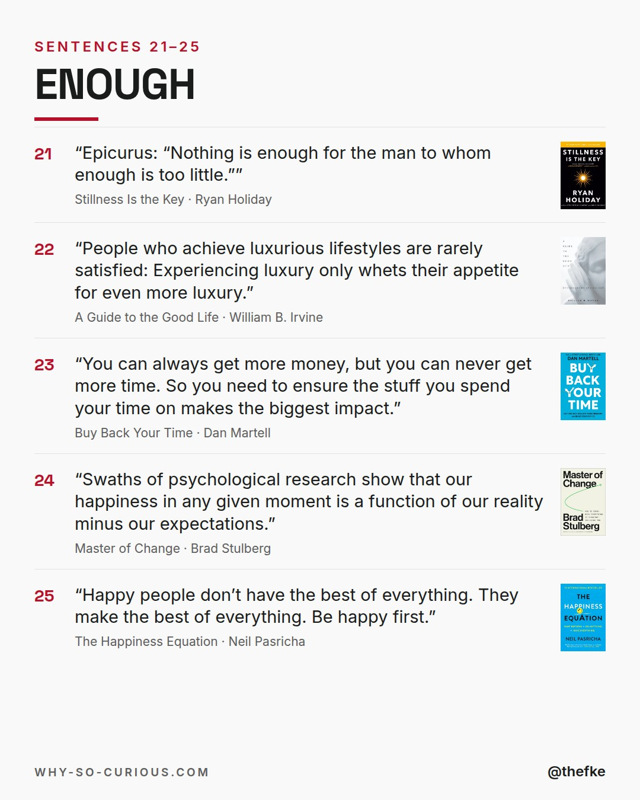
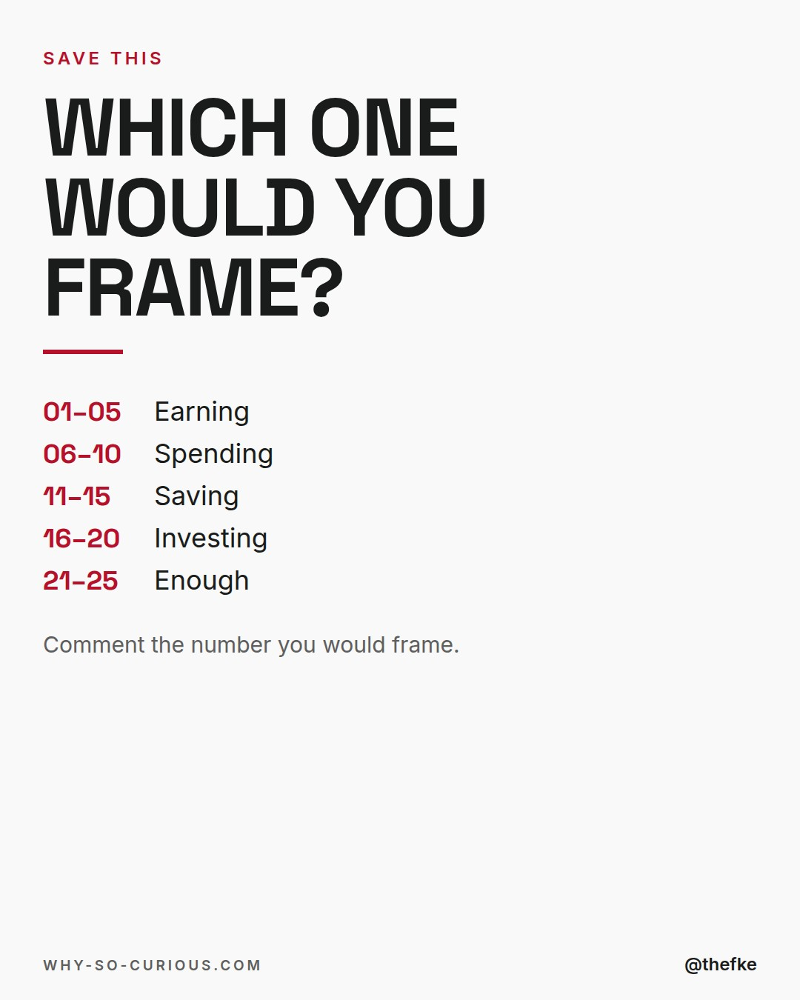

# Mi 16.12. · 25 Sentences About Money

Karussell, 7 Slides. Beim Hochladen 4:5 wählen.

## Caption

```
25 sentences about money.
25 books from my shelf.

Earning. Spending. Saving. Investing.
And knowing when it's enough.
5 each.

The shortest one has six words.
Morgan Housel: “Wealth is what you don’t see.”

Save it for payday.

Which sentence would you frame?

#books #bookstagram #bookrecommendations #reading #thefke #booklover #whysocurious
```

## Slides








