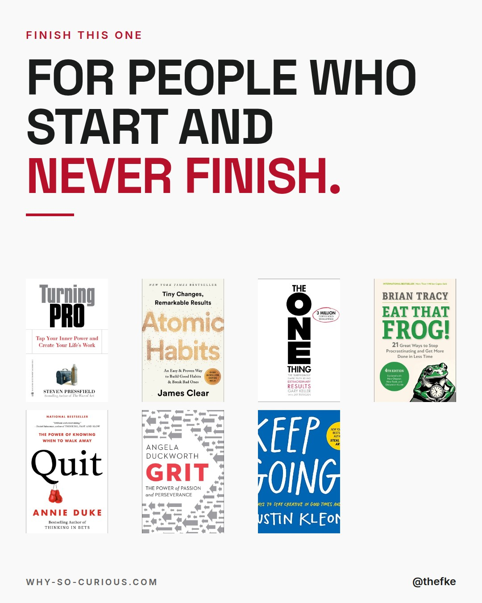
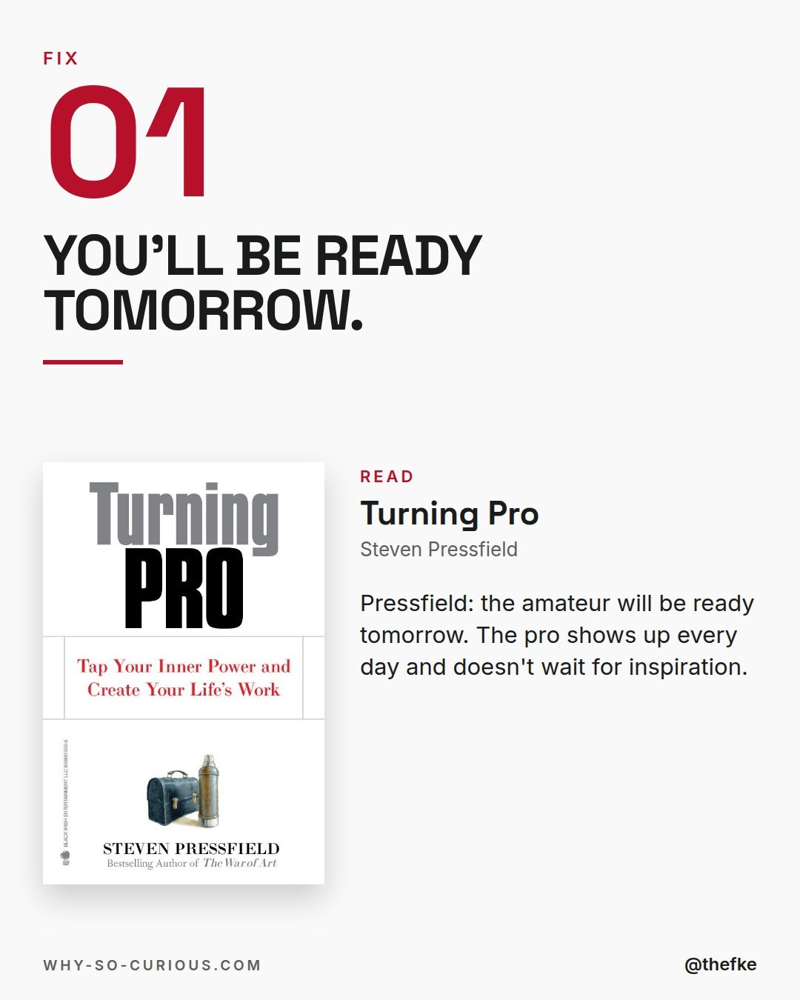
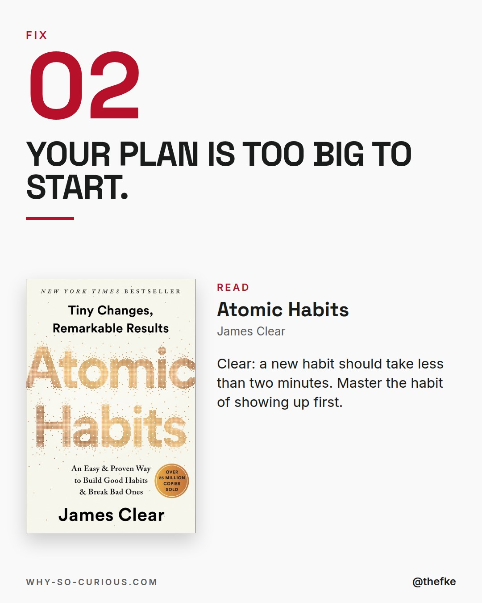
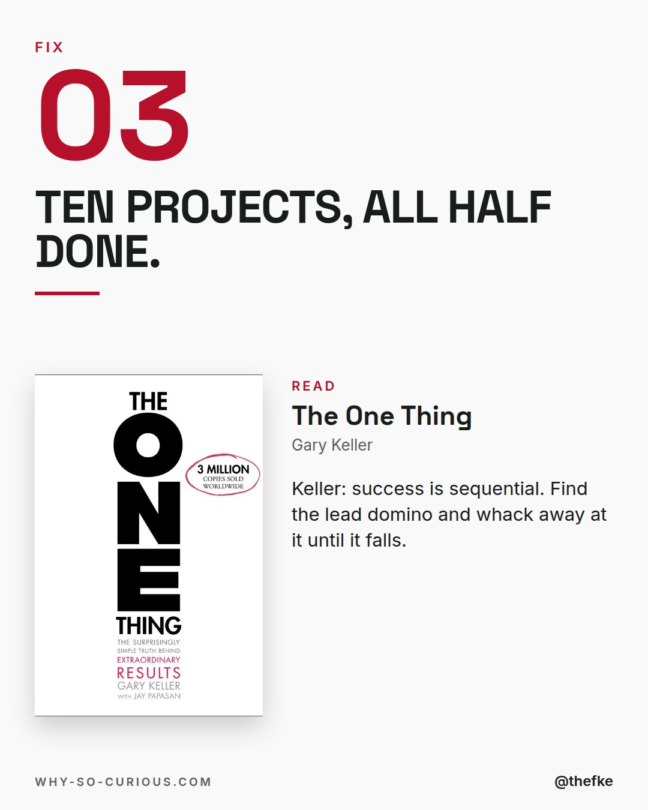
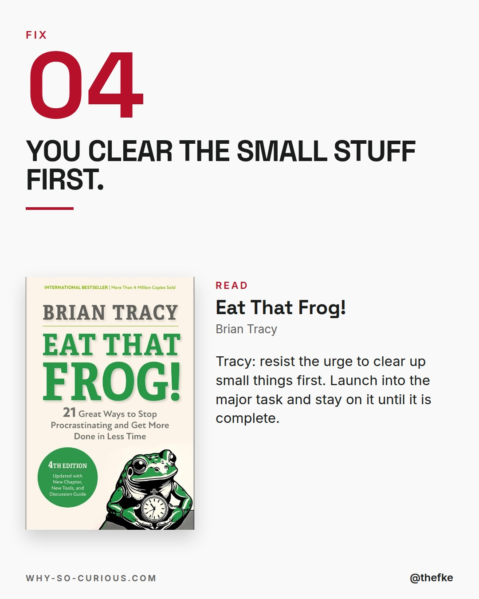
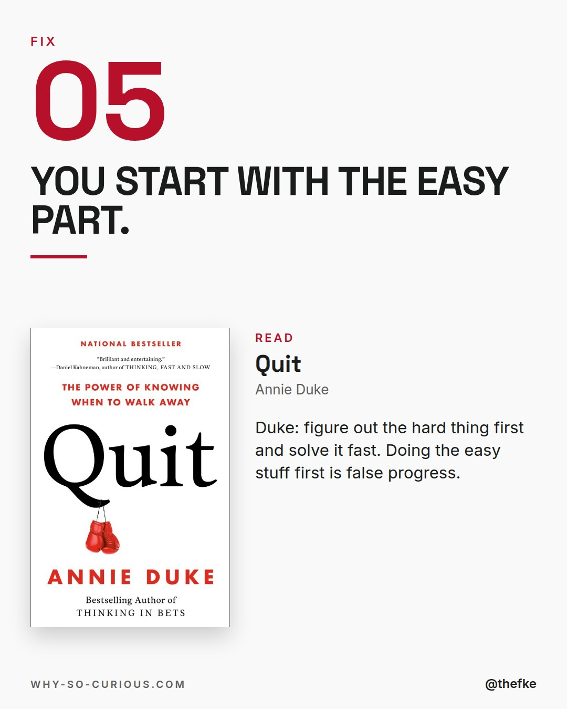
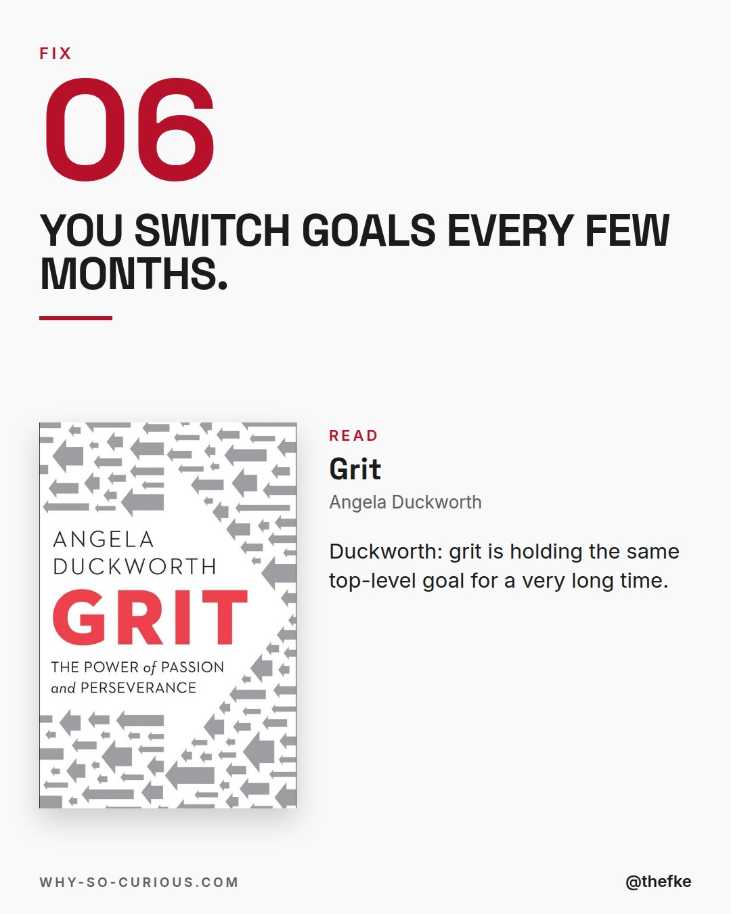
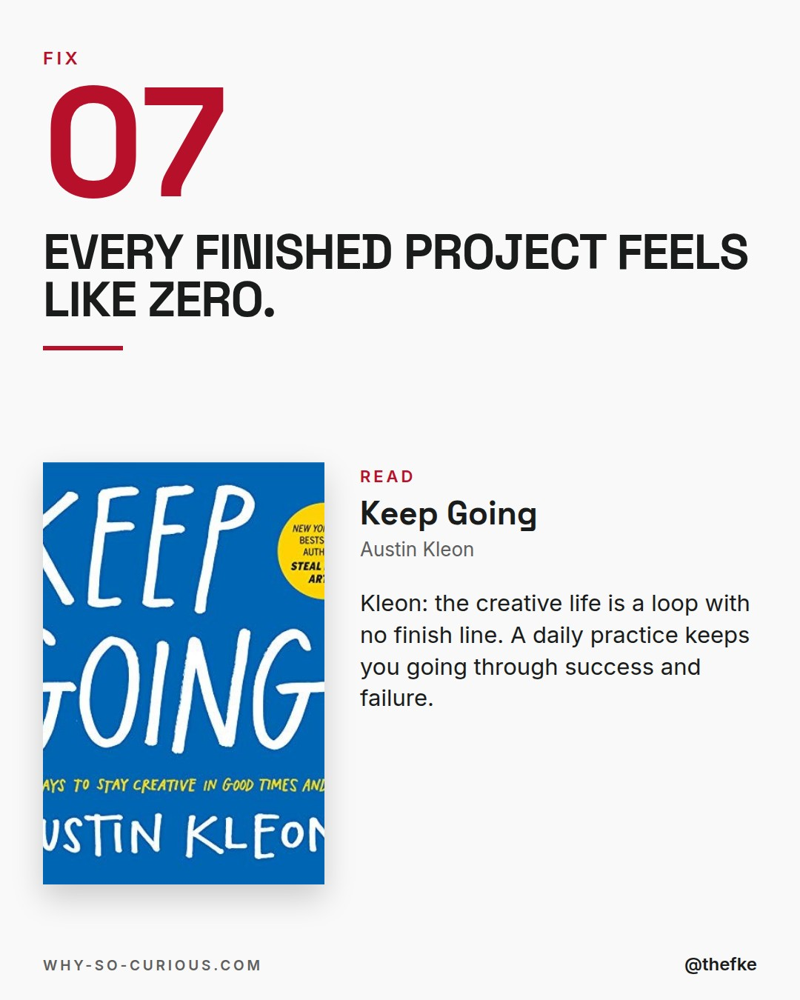
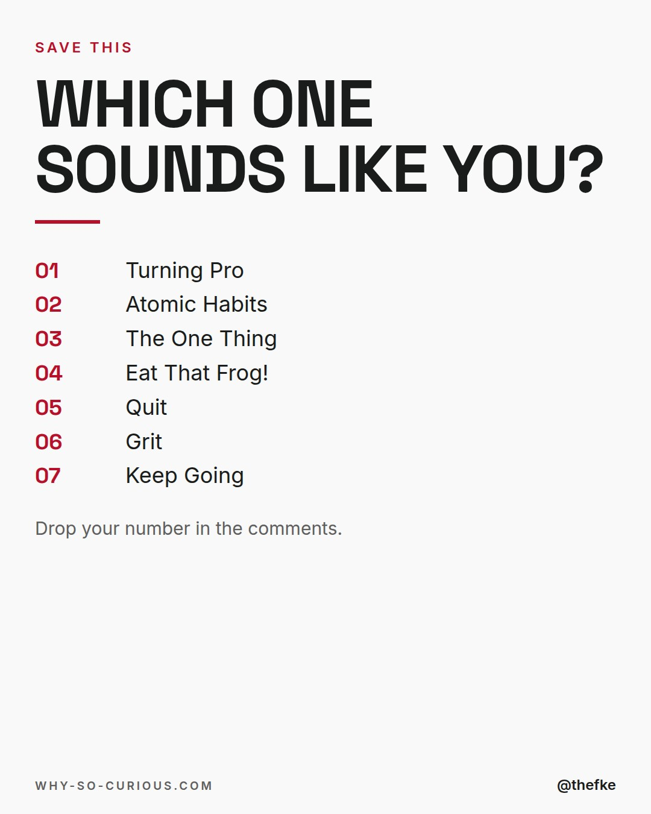

# Mi 16.12. · For people who start and never finish

Karussell, 9 Slides. Beim Hochladen 4:5 wählen.

## Caption

```
Starting feels great.
Week three feels different.

7 books from my shelf for people with too many half-done projects.

Make the first step tiny.
Do the hard part first.
Pick one thing and stay on it.

Annie Duke in Quit:
"Figure out the hard thing first. Try to solve that as quickly as possible. Beware of false progress."

What's the project you never finished?

#books #bookstagram #bookrecommendations #reading #thefke #booklover #whysocurious
```

## Slides










